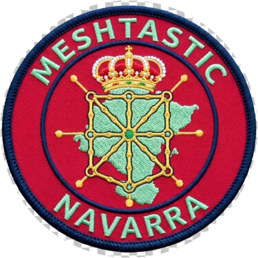

<div align="center">



# NavaTastic

</div>

Firmware **NavaTastic** — fork de [Meshtastic](https://meshtastic.org) v2.7.26 (base `54e0d8d`)
para **repetidores solares de infraestructura** en malla LoRa **SFNarrow** (preset de uso
nacional en España, EU_868). Un solo repositorio genera **12 firmwares** distintos.

```
6 placas/radios × 2 ramas (Routers / Clientes)
```

---

## Qué aporta NavaTastic sobre Meshtastic

| Bloque | Qué hace |
|---|---|
| **Resiliencia solar** | Anti-brownout de arranque, despertar por LPCOMP con histéresis, hibernación *storm*, químicas de batería (`lipo/nimh/sodium/lifepo4` según placa), corte y despertar configurables |
| **Avisos de ciclo de batería** | `[Sueño]` / `[Vivo]` / `[Listo]` / `[Boot]` por el canal Navadmin: el nodo avisa antes de dormir (~1 mA), al despertar por solar/reset, y de cada reinicio con su **causa** (watchdog, ATtiny, soft, brownout...) |
| **NavaCLI `/nava`** | ~45 comandos de administración remota: telemetría, energía, favoritos, bloqueos, rol semi-permanente, mantenimiento. DM cifrado PKI para acciones críticas; canal Navadmin de solo-lectura |
| **Protección de Flash** | Base de nodos con guardado filtrado, auto-favoritos de routers directos, desalojo híbrido, historial sin escritura |
| **Seguridad** | Acreditación admin por PKI persistente tras reboot, auto-recuperación de claves, límite de favoritos huérfanos |
| **Claves admin persistentes** | Las claves de administración del usuario se guardan en el nodo y **vuelven solas tras un factory/full reset** (`keys_ls`/`keys_clear`); tras un fallo completo (`wipe`/`nrf erase`) se re-inyecta la clave de rescate del proyecto |
| **Rol semi-permanente** | `set_role` persiste en `/resilience.bin` y **sobrevive al factory reset** |

## NavaCLI: gestiona todo desde el móvil, sin PC

Con un simple mensaje de texto (DM al repetidor) manejas el nodo completo: **no hace falta
cable, ni PC, ni abrir la interfaz normal de administración**. Toda la gestión del nodo —
consultar su estado, ajustar energía, reiniciar o rescatar un nodo — cabe en un mensaje. Y con
la app **MeshNavarra** se hace **sin escribir**: los comandos van como mensajes predefinidos.

| Comando | Qué hace | Acceso |
|---|---|---|
| `ping` | Latencia, batería, uptime y piso de ruido | Abierto / DM |
| `status` | Salud del nodo: memoria, favoritos Auto/Manual, energía | Abierto / DM |
| `env` | Batería, heap, temperatura CPU y sensores I2C | Abierto / DM |
| `channel` · `peers` · `rxlog` | Uso del espectro · vecinos directos · últimos paquetes | Abierto / DM |
| `afc` · `noise` · `reset_reason` | Deriva del TCXO · piso de ruido · causa del último reinicio | Abierto / DM |
| `bat` · `power` | Química, voltaje, % OCV · métricas de energía | Abierto / DM |
| `route !ID` · `trace !ID` | Ruta y SNR hacia un nodo · trazado de ruta | Abierto / DM |
| `set_chem [lipo/nimh/sodium/lifepo4]` | Cambia la química y ajusta corte/despertar | DM |
| `set_vbat [mV]` · `set_vwake [1-5]` | Corte de apagado · nivel de despertar solar | DM |
| `set_txpower [dBm]` · `set_hops [1-7]` | Potencia de transmisión · límite de saltos | DM |
| `set_role [client/mute/router]` | Rol **semi-permanente** (sobrevive a factory reset) | DM |
| `set_name` · `set_mqtt` · `set_tz` · `ble` | Nombre · MQTT · zona horaria · Bluetooth | DM |
| `txoff` / `txon` | Apagar / encender la transmisión | DM |
| `sleepmsg [on|off]` | Activa/desactiva los avisos [Sueño]/[Vivo]/[Listo]/[Boot] | DM |
| `fav add/rm/ls` · `fav auto` | Favoritos (bypass de saltos) y auto-favoriteo | DM |
| `ign add/rm/ls` | Bloqueo y desbloqueo de nodos | DM |
| `db_purge` · `db_clear` | Limpieza de la base de nodos | DM |
| `reboot` · `factory_reset` · `full_reset` · `wipe` | Reinicio y resets diferidos (el ACK sale antes): fábrica (par PKI nuevo; claves admin vuelven) · completo (conserva PKI, bonds y claves admin) · purga total (par PKI nuevo + claves admin borradas; solo queda la de rescate) | DM |
| `storm [1-720]` | Hibernación por temporizador (radio apagada) | DM |
| `msg "..."` · `bell` · `pos` · `nodeinfo` · `sendtel` | Difundir texto · alarma · posición · baliza · telemetría | DM |
| `admin_ls` · `keys_ls` · `keys_clear` · `help` | Claves admin configuradas · claves **persistidas** (sobreviven a resets) · borrar la copia persistida · ayuda | DM / Abierto* |

*`keys_ls`/`keys_clear` = solo DM PKI.

*Canal abierto (Navadmin) = solo consulta; configuración y acciones críticas = DM cifrado PKI.
Todo comando responde ayuda con `/nava <comando> ?`. **En cualquier nodo, `/nava help` lista los
comandos disponibles para la versión que lleve cargada.***

### NavaTastic + MeshNavarra: hechos para funcionar juntos

El firmware **NavaTastic** y la aplicación **[MeshNavarra-Utility](https://github.com/EA2OY/MeshNavarra-Utility)**
(proyecto hermano, mismo GitHub) son dos proyectos que funcionan **en conjunto y se
complementan**: la app envía los comandos `/nava` como **mensajes predefinidos**, así que toda
la tabla de arriba se maneja **con un par de toques, sin escribir nada**. Para sacar el
**pleno partido** al repetidor solar — consultar su estado, ajustar la energía, reiniciar o
rescatar nodos de toda la flota desde el móvil, sin PC — úsalos juntos: NavaTastic pone la
potencia en el nodo; MeshNavarra pone la comodidad en tu mano.

## Requisito de hardware: divisor ADC 1M+1M (factor 2.0)

Para que la medición de batería y la protección de bajo voltaje funcionen, las placas
**NRF52 (Promicro/Faketec/Albatastic/Xiaowa)** deben medir la batería con un **divisor de dos
resistencias de 1 MΩ** (factor 2.0).

> **¿Tu placa lleva un divisor distinto?** Puedes ajustarlo antes de compilar en
> `variants/nrf52840/diy/nrf52_promicro_diy_tcxo/variant.h` (macro `ADC_MULTIPLIER`, valor
> `VBAT_DIVIDER_COMP`). **Aviso importante**: ese mismo divisor alimenta el comparador
> **LPCOMP**, que decide el **despertar del modo de resiliencia por batería baja** — los niveles
> de `set_vwake` están calibrados para divisor 2.0; con otro divisor el nodo despertará a una
> tensión distinta (recalibrar `getActiveLpcompThreshold()` en
> `src/platform/nrf52/main-nrf52.cpp`).

## Químicas de batería

Los 12 builds compilados usan **LiPo/Li-Ion por defecto** (corte 3500 mV en E22P / 3400 mV en
SX1262). El firmware soporta **4 químicas** y se cambian **sin recompilar** con el comando
`/nava set_chem` (por DM cifrado, persiste en el nodo):

| Química | Corte | Despertar LPCOMP | Notas |
|---|---|---|---|
| **LiPo / Li-Ion** | 3500 mV | ~3.7 V | Default de los builds |
| **NiMH (3 celdas)** | 3400 mV | ~3.7 V | |
| **Sodio (Na-Ion)** | 2600 mV | ~3.7 V | Carga máx ~4.0 V |
| **LiFePO4** | 2800 mV | ~3.3 V | **Solo Promicro y Faketec** (rechazada en Seed/Xiao/T114: su LPCOMP es fijo y no despertarían por solar) |

Para **compilar con otra química como default**: añade al perfil del env
(`profiles/<RAMA>_<Placa>.jsonc`) la macro `"USERPREFS_BATTERY_CHEMISTRY_SODIUM": "true"`
(default sodio) y/o ajusta el corte con `"USERPREFS_LOW_BATTERY_SLEEP_THRESHOLD_MV"` (p. ej.
NiMH = 3400, LiFePO4 = 2800) antes de `pio run`. El resto (umbral de despertar, curvas OCV) se
adapta con los comandos `set_chem` / `set_vbat` / `set_vwake` ya en el nodo.

## Los 12 builds

| Placa | Radio | Rama 2 (Routers) | Rama 1 (Clientes) |
|---|---|---|---|
| Promicro nRF52840 + E22P | E22P (12 dBm) | `navarrico_promicro_e22p_r2ig` | `navarrico_promicro_e22p_r1ig` |
| Promicro/Faketec + HT-RA62 | SX1262 (22 dBm) | `navarrico_faketec_sx1262_r2ig` | `navarrico_faketec_sx1262_r1ig` |
| Seeed Solar Node P1 | SX1262 (22 dBm) | `navarrico_seed_sx1262_r2ig` | `navarrico_seed_sx1262_r1ig` |
| Heltec T114 | SX1262 (22 dBm) | `navarrico_t114_sx1262_r2ig` | `navarrico_t114_sx1262_r1ig` |
| Xiao nRF52840 Kit | SX1262 (22 dBm) | `navarrico_xiao_kit_sx1262_r2ig` | `navarrico_xiao_kit_sx1262_r1ig` |
| Xiao nRF52840 Kit + E22P | E22P (12 dBm) | `navarrico_xiao_e22p_r2ig` | `navarrico_xiao_e22p_r1ig` |

Diferencias declaradas por env/perfil (nunca editando código): potencia TX, curvas OCV y
LPCOMP por placa, rol por rama, claves admin y Bluetooth por perfil (`profiles/*.jsonc`).

**Bluetooth**: los nodos emiten con **PIN fijo `654321`** (modo FIXED_PIN; la app lo pide al
emparejar). Los builds Propia usan un PIN propio del operador.

### Estado de pruebas (banco)

| Placa | Estado |
|---|---|
| **Promicro + E22P (R2IG)** | **Verificado completo** (15/08): ciclo dormir/despertar, avisos, consumo ~1 mA, despertar LPCOMP, [Boot] |
| **Xiao Kit i2c (SX1262)** | **Verificado en banco (15/08)**: ciclo + avisos OK (despertar LPCOMP ~3,8 V ya verificado en campo 11/08) |
| **Xiao Kit i2c + E22P** | **Verificado en banco (15/08)**: ciclo + avisos OK (en banco, TX bajo: picos de corriente del E22P) |
| **Seeed Solar Node P1** | **Semi-testeada** — pendiente de ciclo completo de resiliencia en la placa |
| **Heltec T114** | **PENDIENTE**: testear el ciclo de dormir/despertar de resiliencia del firmware |
| **Faketec HT-RA62** | **Verificada por el operador (14/08) + resets remotos y claves admin persistidas verificados en banco 7/7 (16/08)** |

## Descargas (firmware compilado)

Última versión: **NavaTastic Eclipse V3 (4.3.2, 16/08/2026)** — etiqueta `NAVA V3` en `status`/[Boot],
avisos de sueño/despertar con causa, 8 lecturas de batería baja (~160s) unificadas, resets
remotos `/nava full_reset` (conserva claves PKI) y `/nava wipe` (purga total, par PKI nuevo),
y **claves admin del usuario persistidas** (sobreviven a factory/full reset; regla "slot 0 =
estado previo del usuario"; `keys_ls`/`keys_clear`; banco 7/7).

**Descarga los binarios desde [Releases](https://github.com/EA2OY/NavaTastic/releases/latest)**
(panel de la derecha — *Assets*): 12 UF2 + 12 OTA + 2 manuales PDF. NIMH = mismos binarios
que LIPO (solo aplican Faketec y XiaoKitI2c). Los mismos ficheros son navegables en
[`distribucion/`](distribucion/) (`Rama 2 Routers` / `Rama 1 Clientes` × `LIPO`/`NIMH` ×
`UF2`/`OTA`).

### Manuales (PDF, bilingües ES+EN)

- [Manual de administración remota `/nava` (PDF)](docs/pdf/Manual_NavaTastic.pdf) — comandos completos
- [Manual de uso del firmware (PDF)](docs/pdf/Manual_uso_NavaTastic_4.2.pdf) — montaje, requisitos de hardware, protocolo de rescate

## Flashear

- **nRF52 (todas las placas)**: con el nodo en modo DFU (doble clic en reset) aparece una
  unidad **NICENANO** → copiar el `.uf2`. Alternativa: `pio run -e <env> -t upload
  --upload-port COMx`.
- **Tras flashear un nodo nuevo de fábrica**: hacer **un factory reset** para materializar
  el canal Navadmin (los avisos y la consulta por canal abierto dependen de él).
- **Copia de seguridad de claves**: el flasheo por sí solo **conserva** los `/prefs` del nodo
  (claves, canales, nombre). **Las claves admin del usuario también sobreviven a los resets de
  fábrica** (F20): se guardan en el nodo y vuelven solas tras un factory/full reset. Lo que sí
  cambia con `factory_reset` es el **par PKI del nodo** (los demás nodos tendrán que reaprender
  su clave para el DM cifrado), y `wipe`/`nrf erase` lo purgan todo (identidad nueva + solo la
  clave de rescate del proyecto). Exporta la configuración desde la app antes de un `wipe`/`nrf
  erase` si quieres conservarla.
- **Pruebas en banco**: el E22P es inestable en TX con USB (picos de corriente) — usar
  **TX 1 dBm**; la detección de batería baja exige alimentar **sin USB**.

## Compilar

Requisitos: PlatformIO (`pio`). Desde la raíz del repo:

```bash
pio run -e navarrico_promicro_e22p_r2ig   # un env
pio run                                    # los 12 (default_envs)
```

Ver también: `Guia_para_agente_sobre_NavaTastic.md` (mecánica completa),
`docs/transfer_context.md` (memoria técnica) y `docs/cerebro/` (documentación de diseño).

## Rama propia (claves privadas)

Los builds **Propia** (`r2ip`/`r1ip`) usan claves admin y PIN Bluetooth propios que **no se
almacenan en este repositorio**: se piden al compilar.

```powershell
.\build_propia.ps1 -EnvName navarrico_promicro_e22p_r2ip
```

## Seguridad

- El canal Navadmin usa la **PSK pública** de Meshtastic (`{0x01}`, slot 1): cualquiera puede
  escuchar. Solo admite consultas de lectura; los comandos críticos van por **DM cifrado PKI**.
- Las claves admin que lleva el firmware son **públicas** (el binario nunca contiene privadas).

### Gestión de claves admin (altamente recomendable)

El firmware sale con una clave admin **de fábrica** (la del proyecto). Para tu red:

1. **Añade DOS claves de gestión remota propias** (de tus dispositivos de mando) desde la app
   de Meshtastic → *Radio config → Security → Admin key* (el firmware admite 3 slots).
2. **Comprueba que funcionan**: con cada mando, envía un comando `/nava` por DM — debe
   responder (el repetidor acredita a ese mando como admin y lo guarda en disco).
3. **Desautoriza la clave de fábrica** una vez verificadas las tuyas: pon **una de tus claves
   en el slot 0** (sustituyendo a la de fábrica). Ojo: si el slot 0 queda **vacío**, el
   firmware **re-inyecta la clave de fábrica en cada arranque** (auto-recuperación anti-bloqueo),
   así que dejarlo vacío NO la desautoriza — hay que sobreescribirlo con la tuya. **Tu
   desautorización se guarda en el nodo**: sobrevive a los resets de fábrica (el nodo despierta
   con tu clave en el slot 0). ⚠️ **Quitar una clave desde la app NO la purga del nodo** (queda
   la copia guardada): para borrarla de verdad usa `/nava keys_clear` o `/nava wipe`.

### La clave de fábrica es una herramienta de rescate integrada

La clave admin pre-hardcodeada no es un descuido: es la **llave de rescate del proyecto**. El
firmware **inyecta la clave de rescate automáticamente** cuando el nodo queda sin estado previo
que restaurar: tras un **fallo completo** (`wipe`/`nrf erase`, corrupción de la configuración) o
un reset de fábrica en un nodo que **nunca desautorizó la de fábrica** — quien guarda su clave
privada (el operador del proyecto) puede **volver a entrar por DM, restaurar el nodo y dejarlo de
nuevo con la clave de su dueño**. Sin ella, un nodo reseteado en altura quedaría huérfano e
inalcanzable. Por eso el firmware también la re-inyecta si el slot 0 queda vacío. **Nota (F20)**:
si el dueño puso SU clave en el slot 0, tras un factory/full reset el nodo vuelve con SU clave
(desautorización persistente, sin ventana de secuestro) — la de rescate solo volvería a entrar
tras un `wipe`, o si el dueño la re-autoriza poniéndola en el slot 0.

**¿Prefieres que tus nodos arranquen ya con TU clave?** Es fácil cambiarla a mano con VS Code
(no hace falta tocar código C++):

1. Abre `profiles/<RAMA>_<Placa>.jsonc` (p. ej. `profiles/R2IG_Promicro.jsonc`).
2. Busca `USERPREFS_USE_ADMIN_KEY_0` y sustituye los 32 bytes hex por los de **tu clave pública**
   (en la app Meshtastic aparece en base64: *Radio config → Device → Public key*; conviértela a
   hex con cualquier conversor base64→hex, p. ej. `echo "<base64>" | base64 -d | xxd -p`).
3. Guarda y compila: `pio run -e <env>`. Los slots 1-2 se siguen gestionando desde la app.

Ten en cuenta que al cambiar la clave pre-hardcodeada pierdes el canal de rescate del proyecto:
guarda bien la clave privada correspondiente a la tuya.

**Para inyectar la clave de rescate en un nodo de mando** (protocolo completo en el manual de
uso): con la app **actual** de Meshtastic (Play Store), entra en **Ajustes → Seguridad** del nodo
de mando, borra el campo **"Clave Privada"** y pega la clave privada del proyecto; al
guardar/enviar, la clave pública correcta **se regenera sola**. Si no se queda aplicada, repite
la operación (bug conocido de la app).

## Licencia

- **Firmware (código de este repositorio)**: **GPL v3** — heredada de
  [meshtastic/firmware](https://github.com/meshtastic/firmware), del que NavaTastic es un fork.
  Ver [LICENSE](LICENSE). Las modificaciones de NavaTastic se publican bajo la misma licencia.
- **Cumplimiento GPL**: los binarios distribuidos en [`distribucion/`](distribucion/) tienen su
  código fuente completo en **este mismo repositorio, en el mismo commit** — cualquier persona
  que descargue un binario puede obtener su fuente aquí, como exige la GPL v3. Se conservan los
  avisos de copyright de Meshtastic en todas las fuentes.
- **Hardware**: los diseños de placas (cuando se publiquen) se licenciarán aparte
  (p. ej. **CERN-OHL**, Open Hardware License). Este repositorio solo contiene firmware y
  documentación.

## Descargo de responsabilidad

- Este firmware se distribuye **SIN GARANTÍA DE NINGÚN TIPO** (ni implícita de comerciabilidad
  ni de aptitud para un fin concreto), bajo los términos de la GPL v3. Úsalo **bajo tu propia
  responsabilidad**.
- Un repetidor solar es un dispositivo que se instala en altura, con baterías y alimentación
  solar: el montaje, el dimensionado de batería/panel y el mantenimiento son responsabilidad
  del instalador. Respeta las advertencias del manual de uso.
- **Cumplimiento normativo del montaje**: toda instalación con este firmware debe cumplir la
  normativa que le sea de aplicación (nacional, autonómica, local y europea): emplazamiento,
  permisos de acceso y obra, seguridad y medio ambiente. Dónde y cómo se monta el equipo
  (árboles, estructuras, propiedades ajenas...) es decisión y responsabilidad exclusiva de
  quien lo instala.
- El proyecto queda **desvinculado** de cualquier montaje o uso de terceros: no mantiene
  relación alguna con instalaciones ajenas y no asume responsabilidad por usos que no se
  ajusten a la legislación vigente.
- **Uso del espectro radioeléctrico**: los builds están configurados para la banda EU_868 con
  el preset LoRa SFNarrow. Verifica que el uso de la frecuencia y la potencia cumplen la
  normativa de tu país antes de transmitir.
- La configuración por defecto (canales, PSK pública del canal Navadmin, claves admin
  públicas) está pensada para la malla de este proyecto: revísala antes de desplegar tus
  propios nodos.
- Los nodos conectados a una malla pública pueden ser visibles para terceros: no envíes por
  radio información sensible.

---

# NavaTastic (English)

Firmware **NavaTastic** � a [Meshtastic](https://meshtastic.org) v2.7.26 fork (base `54e0d8d`)
for **solar-powered infrastructure repeaters** on the **SFNarrow** LoRa preset (EU_868,
national preset used in Spain). A single repository produces **12 different firmwares**
(6 boards/radios � 2 branches: Routers / Clients).

## What NavaTastic adds on top of Meshtastic

| Area | What it does |
|---|---|
| **Solar resilience** | Boot brownout protection, LPCOMP wake-up with hysteresis, storm hibernation, battery chemistries (`lipo/nimh/sodium/lifepo4` per board), configurable cutoff and wake voltage |
| **Battery cycle notices** | `[Sueno]` / `[Vivo]` / `[Listo]` / `[Boot]` messages on the Navadmin channel: the node announces before sleeping (~1 mA), when waking up on solar/external reset, and every reboot **with its cause** (watchdog, reset pin, soft, brownout...) |
| **NavaCLI `/nava`** | ~45 remote administration commands: telemetry, energy, favorites, blocklist, semi-permanent role, maintenance. Critical actions require PKI-encrypted DM; the Navadmin channel is read-only |
| **Flash protection** | Filtered node database writes, auto-favoriting of direct routers, hybrid eviction, no transmit-history writes |
| **Security** | Persistent admin accreditation across reboots, admin-key auto-recovery, orphan-favorite limit |
| **Persistent admin keys** | The user's admin keys are stored on the node and **come back on their own after a factory/full reset** (`keys_ls`/`keys_clear`); after a complete failure (`wipe`/`nrf erase`) the project rescue key is re-injected |
| **Semi-permanent role** | `set_role` persists in `/resilience.bin` and **survives factory reset** |

## The 12 builds

| Board | Radio | Branch 2 (Routers) | Branch 1 (Clients) |
|---|---|---|---|
| Promicro nRF52840 + E22P | E22P (12 dBm) | `navarrico_promicro_e22p_r2ig` | `navarrico_promicro_e22p_r1ig` |
| Promicro/Faketec + HT-RA62 | SX1262 (22 dBm) | `navarrico_faketec_sx1262_r2ig` | `navarrico_faketec_sx1262_r1ig` |
| Seeed Solar Node P1 | SX1262 (22 dBm) | `navarrico_seed_sx1262_r2ig` | `navarrico_seed_sx1262_r1ig` |
| Heltec T114 | SX1262 (22 dBm) | `navarrico_t114_sx1262_r2ig` | `navarrico_t114_sx1262_r1ig` |
| Xiao nRF52840 Kit | SX1262 (22 dBm) | `navarrico_xiao_kit_sx1262_r2ig` | `navarrico_xiao_kit_sx1262_r1ig` |
| Xiao nRF52840 Kit + E22P | E22P (12 dBm) | `navarrico_xiao_e22p_r2ig` | `navarrico_xiao_e22p_r1ig` |

Differences are declared per env/profile (never by editing code): TX power, OCV curves and
LPCOMP per board, role per branch, admin keys and Bluetooth per profile (`profiles/*.jsonc`).

**Bluetooth**: nodes broadcast with a **fixed PIN `654321`** (FIXED_PIN mode; the app asks for
it when pairing). Propia builds use the operator's own PIN.

### NavaCLI: manage everything from your phone, no PC needed

A single text message (DM to the repeater) drives the whole node: **no cable, no PC, no normal
admin interface**. Checking status, tuning energy, rebooting or rescuing a node — one message
does it all. With the **MeshNavarra** app you do it **without typing**: commands are
predefined messages.

| Command | What it does | Access |
|---|---|---|
| `ping` | Latency, battery, uptime, noise floor | Open / DM |
| `status` | Node health: memory, Auto/Manual favorites, energy | Open / DM |
| `env` | Battery, heap, CPU temp and I2C sensors | Open / DM |
| `channel` · `peers` · `rxlog` | Spectrum use · direct neighbors · last packets | Open / DM |
| `afc` · `noise` · `reset_reason` | TCXO drift · noise floor · last reset cause | Open / DM |
| `bat` · `power` | Chemistry, voltage, OCV % · power metrics | Open / DM |
| `route !ID` · `trace !ID` | Path and SNR to a node · traceroute | Open / DM |
| `set_chem [lipo/nimh/sodium/lifepo4]` | Switch chemistry, adjusts cutoff/wake | DM |
| `set_vbat [mV]` · `set_vwake [1-5]` | Shutdown cutoff · solar wake level | DM |
| `set_txpower [dBm]` · `set_hops [1-7]` | TX power · hop limit | DM |
| `set_role [client/mute/router]` | **Semi-permanent** role (survives factory reset) | DM |
| `set_name` · `set_mqtt` · `set_tz` · `ble` | Name · MQTT · timezone · Bluetooth | DM |
| `txoff` / `txon` | Disable / enable transmission | DM |
| `sleepmsg [on|off]` | Enable/disable the [Sueno]/[Vivo]/[Listo]/[Boot] notices | DM |
| `fav add/rm/ls` · `fav auto` | Favorites (hop bypass) and auto-favoriting | DM |
| `ign add/rm/ls` | Block / unblock nodes | DM |
| `db_purge` · `db_clear` | Node database cleanup | DM |
| `reboot` · `factory_reset` · `full_reset` · `wipe` | Deferred reboot and resets (ACK first): factory (new PKI pair; admin keys return) · full (keeps PKI, bonds and admin keys) · wipe (total purge: new PKI pair + admin keys deleted; only the rescue key remains) | DM |
| `storm [1-720]` | Timed hibernation (radio off) | DM |
| `msg "..."` · `bell` · `pos` · `nodeinfo` · `sendtel` | Broadcast text · alarm · position · beacon · telemetry | DM |
| `admin_ls` · `keys_ls` · `keys_clear` · `help` | Configured admin keys · **persisted** keys (survive resets) · clear the persisted copy · command help | DM / Open* |

*`keys_ls`/`keys_clear` = DM PKI only.

*Open channel (Navadmin) = read-only queries; configuration and critical actions = PKI-encrypted
DM. Every command answers help with `/nava <command> ?`. **On any node, `/nava help` lists the
commands available for the version it runs.***

### NavaTastic + MeshNavarra: built to work together

The **NavaTastic** firmware and the **MeshNavarra** app are two projects that **work together
and complement each other**: the app sends the `/nava` commands as **predefined messages**, so
the whole table above is handled **with a couple of taps, no typing**. To get the **full
value** out of the solar repeater — check status, tune energy, reboot or rescue nodes across
the fleet from your phone, no PC — use them together: NavaTastic puts the power in the node;
MeshNavarra puts the convenience in your hand.

## Hardware requirement: ADC divider 1M+1M (ratio 2.0)

For battery measurement and low-voltage protection to work, **NRF52 boards
(Promicro/Faketec/Albatastic/Xiaowa)** must measure the battery through a divider made of
**two 1 MO resistors** (ratio 2.0).

> **Different divider on your board?** Adjust it before compiling in
> `variants/nrf52840/diy/nrf52_promicro_diy_tcxo/variant.h` (macro `ADC_MULTIPLIER`, value
> `VBAT_DIVIDER_COMP`). **Important**: the same divider feeds the **LPCOMP** comparator, which
> decides the **low-battery resilience wake-up** � the `set_vwake` levels are calibrated for a
> 2.0 divider; with a different divider the node will wake at a different voltage (recalibrate
> `getActiveLpcompThreshold()` in `src/platform/nrf52/main-nrf52.cpp`).

### Battery chemistries

The 12 compiled builds default to **LiPo/Li-Ion** (cutoff 3500 mV on E22P / 3400 mV on SX1262).
The firmware supports **4 chemistries**, switchable **without recompiling** via `/nava set_chem`
(encrypted DM, persisted on the node):

| Chemistry | Cutoff | LPCOMP wake | Notes |
|---|---|---|---|
| **LiPo / Li-Ion** | 3500 mV | ~3.7 V | Default in the builds |
| **NiMH (3 cells)** | 3400 mV | ~3.7 V | |
| **Sodium (Na-Ion)** | 2600 mV | ~3.7 V | Max charge ~4.0 V |
| **LiFePO4** | 2800 mV | ~3.3 V | **Promicro and Faketec only** (rejected on Seed/Xiao/T114: their LPCOMP is fixed and they would never wake on solar) |

To **compile with a different default chemistry**: add
`"USERPREFS_BATTERY_CHEMISTRY_SODIUM": "true"` to the env profile
(`profiles/<BRANCH>_<Board>.jsonc`) and/or set the cutoff with
`"USERPREFS_LOW_BATTERY_SLEEP_THRESHOLD_MV"` (e.g. NiMH = 3400, LiFePO4 = 2800) before
`pio run`. Wake threshold and OCV curves are adjusted on the node with
`set_chem` / `set_vbat` / `set_vwake`.

### Bench test status

| Board | Status |
|---|---|
| **Promicro + E22P (R2IG)** | **Fully verified** (15/08): sleep/wake cycle, notices, ~1 mA sleep, LPCOMP wake, [Boot] |
| **Xiao Kit i2c (SX1262)** | **Bench verified (15/08)**: full cycle + notices OK (LPCOMP wake ~3.8 V already field-verified 11/08) |
| **Xiao Kit i2c + E22P** | **Bench verified (15/08)**: full cycle + notices OK (bench: low TX — E22P current spikes) |
| **Seeed Solar Node P1** | **Semi-tested** — full resilience cycle on the board still pending |
| **Heltec T114** | **PENDING**: test the firmware sleep/wake resilience cycle |
| **Faketec HT-RA62** | **Operator-verified (14/08) + remote resets and persisted admin keys bench-verified 7/7 (16/08)** |

## Downloads (prebuilt firmware)

Latest release: **NavaTastic Eclipse V3 (4.3.2, 16/08/2026)** — `NAVA V3` tag in `status`/[Boot], sleep/wake
notices with reset cause, unified 8 low-battery readings (~160 s), remote resets `/nava full_reset`
(keeps PKI keys) and `/nava wipe` (total purge, new PKI pair), and **user admin keys persisted**
(survive factory/full reset; "slot 0 = the user's previous state" rule; `keys_ls`/`keys_clear`;
bench 7/7).

**Download the binaries from [Releases](https://github.com/EA2OY/NavaTastic/releases/latest)**
(right-hand panel — *Assets*): 12 UF2 + 12 OTA + 2 PDF manuals. NIMH = same binaries as LIPO
(Faketec and XiaoKitI2c only). The same files are browsable under
[`distribucion/`](distribucion/) (`Rama 2 Routers` / `Rama 1 Clientes` × `LIPO`/`NIMH` ×
`UF2`/`OTA`).

### Manuals (PDF, bilingual ES+EN)

- [Remote administration manual `/nava` (PDF)](docs/pdf/Manual_NavaTastic.pdf)
- [Firmware user manual (PDF)](docs/pdf/Manual_uso_NavaTastic_4.2.pdf)

## Flashing

- **nRF52 (all boards)**: put the node in DFU mode (double-press reset) � a **NICENANO** drive
  appears � copy the `.uf2` into it. Alternative: `pio run -e <env> -t upload
  --upload-port COMx`.
- **After flashing a factory-new node**: perform **one factory reset** to materialize the
  Navadmin channel (notices and open-channel queries depend on it).
- **Key backup**: flashing by itself **keeps** the node `/prefs` (keys, channels, name). **The
  user's admin keys also survive factory resets** (F20): they are stored on the node and come
  back on their own after a factory/full reset. What `factory_reset` does change is the node's
  **PKI pair** (other nodes must re-learn its key for encrypted DM), and `wipe`/`nrf erase`
  purge everything (new identity + only the project rescue key). Export the configuration from
  the app before a `wipe`/`nrf erase` if you want to keep it.
- **Bench testing**: the E22P TX is unstable over USB (current spikes) � use **1 dBm TX**; the
  low-battery detection requires powering **without USB**.

## Building

Requires PlatformIO (`pio`). From the repo root:

```bash
pio run -e navarrico_promicro_e22p_r2ig   # one env
pio run                                    # all 12 (default_envs)
```

See also `Guia_para_agente_sobre_NavaTastic.md` (full mechanics),
`docs/transfer_context.md` (technical memory) and `docs/cerebro/` (design docs) � Spanish.

## Private branch (own keys)

The **Propia** builds (`r2ip`/`r1ip`) use your own admin keys and Bluetooth PIN, which are
**not stored in this repository** � they are asked at build time:

```powershell
.\build_propia.ps1 -EnvName navarrico_promicro_e22p_r2ip
```

## Security

- The Navadmin channel uses Meshtastic's **public PSK** (`{0x01}`, slot 1): anyone can listen.
  It only accepts read-only queries; critical commands require **PKI-encrypted DM**.
- Admin keys shipped in the firmware are **public** (the binary never contains private keys).

### Admin key management (highly recommended)

The firmware ships with a **factory admin key** (the project's key). For your own network:

1. **Add TWO of your own remote-management keys** (from your control devices) via the
   Meshtastic app — *Radio config — Security — Admin key* (3 slots available).
2. **Verify they work**: from each control device send a `/nava` command over DM — it must
   respond (the repeater accredits that device as admin and saves it to disk).
3. **De-authorize the factory key** once yours are verified: put **one of your keys in slot 0**
   (replacing the factory key). Note: if slot 0 is left **empty**, the firmware **re-injects
   the factory key on every boot** (anti-lockout auto-recovery) — leaving it empty does NOT
   de-authorize it; you must overwrite it with your own. **Your de-authorization is stored on
   the node**: it survives factory resets (the node wakes up with your key in slot 0).
   ⚠️ **Removing a key in the app does NOT purge it from the node** (the saved copy remains):
   to truly remove it use `/nava keys_clear` or `/nava wipe`.

### The factory key is a built-in rescue tool

The pre-hardcoded admin key is not an oversight: it is the **project's rescue key**. The
firmware **injects the rescue key automatically** when the node has no previous state to
restore: after a **complete failure** (`wipe`/`nrf erase`, corrupted configuration) or a factory
reset on a node that **never de-authorized the factory key** — whoever holds its private key
(the project operator) can **get back in over DM, restore the node and leave it again with its
owner's own key**. Without it, a reset node on a mast would be orphaned and unreachable. That is
also why the firmware re-injects it when slot 0 is left empty. **Note (F20)**: if the owner put
THEIR key in slot 0, after a factory/full reset the node returns with THEIR key (persistent
de-authorization, no hijack window) — the rescue key would only come back after a `wipe`, or if
the owner re-authorizes it by putting it in slot 0.

**Prefer your nodes to boot with YOUR key?** Changing it by hand with VS Code is easy (no C++
code involved):

1. Open `profiles/<BRANCH>_<Board>.jsonc` (e.g. `profiles/R2IG_Promicro.jsonc`).
2. Find `USERPREFS_USE_ADMIN_KEY_0` and replace the 32 hex bytes with those of **your public
   key** (the Meshtastic app shows it in base64: *Radio config — Device — Public key*; convert
   it to hex with any base64-to-hex converter, e.g. `echo "<base64>" | base64 -d | xxd -p`).
3. Save and build: `pio run -e <env>`. Slots 1-2 are still managed from the app.

Keep in mind that changing the pre-hardcoded key removes the project's rescue channel: keep the
private key matching your own well backed up.

**To inject the rescue key into a control node** (full protocol in the user manual): with the
**current** Meshtastic app (Play Store), open the control node's **Settings — Security**, clear
the **"Private Key"** field and paste the project's private key; on save/send the correct public
key **regenerates by itself**. If it does not stick, repeat the operation (known app bug).

## License

- **Firmware (code in this repository)**: **GPL v3** � inherited from
  [meshtastic/firmware](https://github.com/meshtastic/firmware), of which NavaTastic is a fork.
  See [LICENSE](LICENSE). NavaTastic changes are published under the same license.
- **GPL compliance**: the binaries distributed under [`distribucion/`](distribucion/) have
  their full source code in **this same repository, at the same commit** � anyone downloading
  a binary can get its source here, as GPL v3 requires. Meshtastic copyright notices are kept
  in all sources.
- **Hardware**: board designs (when published) will be licensed separately (e.g. **CERN-OHL**,
  Open Hardware License). This repository contains firmware and documentation only.

## Disclaimer

- This firmware is distributed **WITHOUT WARRANTY OF ANY KIND** (not even implied
  merchantability or fitness for a particular purpose), under the terms of GPL v3. Use it
  **at your own risk**.
- A solar repeater is a device installed at height, with batteries and solar power: mounting,
  battery/panel sizing and maintenance are the installer's responsibility. Follow the user
  manual warnings.
- **Regulatory compliance of the installation**: any installation using this firmware must
  comply with the regulations applicable to it (national, regional, local and European):
  site, access and works permits, safety and environment. Where and how the equipment is
  mounted (trees, structures, third-party property...) is the sole decision and responsibility
  of whoever installs it.
- The project is **dissociated** from any third-party installation or use: it holds no
  relationship with third-party deployments and assumes no responsibility for uses that do
  not comply with current legislation.
- **Radio spectrum use**: the builds are configured for the EU_868 band with the SFNarrow
  LoRa preset. Check that the frequency and power comply with your country's regulations
  before transmitting.
- The default configuration (channels, public Navadmin PSK, public admin keys) is meant for
  this project's mesh: review it before deploying your own nodes.
- Nodes connected to a public mesh may be visible to third parties: do not send sensitive
  information over the air.