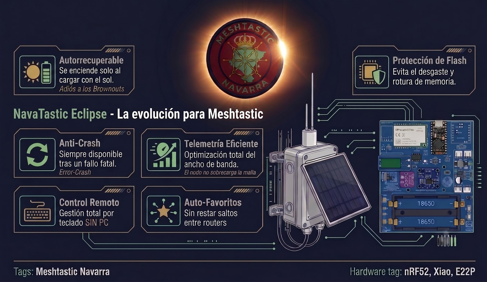

 

[-brightgreen?logo=checkmarx&logoColor=white)](docs/pdf/INFORME_AUDITORIA_ULTRA_EXHAUSTIVA_NAVATASTIC_V4.pdf)

> 🏆 **Generación NavaTastic Eclipse V4 (17/08/2026)**:  
> NavaTastic 4.3.3 V4 incorpora **Consola Privada de Gestión de Flota en Lote**, **Blindaje Anti-Tormentas en Canal Público**, **Lista Negra Global Persistente**, **Control Granular de Telemetría/Posición** y **16 Comandos Avanzados**.  
> 🛡️ **[Informe de Auditoría V4 (PDF)](docs/pdf/INFORME_AUDITORIA_ULTRA_EXHAUSTIVA_NAVATASTIC_V4.pdf)** · 📋 **[Leer Auditoría en GitHub](docs/INFORME_AUDITORIA_ULTRA_EXHAUSTIVA_NAVATASTIC_V4.md)**  
> 📄 **[Manual de Comandos (PDF)](docs/pdf/Manual_NavaTastic.pdf)** ([Leer en GitHub](docs/Manual_NavaTastic.md)) · 📘 **[Guía de Uso (PDF)](docs/pdf/Manual_uso_NavaTastic.pdf)** ([Leer en GitHub](docs/Manual_uso_NavaTastic.md))

---

**NavaTastic** es un firmware optimizado y endurecido sobre la base de [Meshtastic](https://meshtastic.org) v2.7.26, diseñado específicamente para **repetidores solares autónomos de alta montaña e infraestructura fija** en la red LoRa de España (**SFNarrow / EU_868**).

Con un solo código fuente genera **12 firmwares listos para usar** (6 tipos de placas/radios en ramas de Routers y Clientes).

---

## ⚡ Guía Rápida de Instalación en 5 Pasos (Para quien tiene prisa)

> ⚠️ **¡ATENCIÓN! La causa #1 de fallos es no hacer el Reset de Fábrica.** Si vienes de otro firmware o versión previa, Meshtastic conserva los archivos antiguos en flash y **NO** desplegará el canal `Navadmin` ni el perfil optimizado hasta que ejecutes el **Paso 4**.

### 1️⃣ Paso 1: Comprueba que tu Hardware es Compatible
* **Microcontrolador**: Compatible con placas **Nordic nRF52840** (Promicro DIY, Faketec, Seeed Xiao, Heltec T114). *(Revisa la tabla de descargas abajo)*.
* **Divisor de Batería**: Las placas DIY deben llevar un divisor resistivo **1 MΩ + 1 MΩ (factor 2.0)** para que la medición ADC y el comparador de corte solar **LPCOMP** funcionen con precisión.

### 2️⃣ Paso 2: Flashea el Firmware NavaTastic
* **Vía Cable USB (.UF2)**: Conecta la placa al PC, haz **doble pulsación rápida en el botón RESET** para que aparezca la unidad de disco USB (`NICENANO` o similar) y arrastra el archivo `.uf2` correspondiente a tu placa.
* **Vía Actualización OTA (.zip)**: Si ya estás conectado por Bluetooth, actualiza desde la App oficial de Meshtastic seleccionando el `.zip` OTA.
* **Emparejamiento Bluetooth**: El PIN de conexión por defecto es **`654321`** (modo `FIXED_PIN`).

### 3️⃣ Paso 3: Respalda tu Clave Privada *(Opcional)*
* Si deseas **mantener la misma identidad de nodo y tus conversaciones previas**, copia tu clave privada (`private_key`) desde la App antes del reseteo para restaurarla después. Si es un nodo nuevo, salta este paso y el firmware generará una identidad limpia Curve25519.

### 4️⃣ Paso 4: 🔴 FACTORY RESET (Paso Imprescindible)
* **¿Por qué?** Meshtastic almacena la configuración en `/prefs/config.proto`. Al flashear un firmware nuevo, la flash vieja bloquea la inyección de los canales de fábrica.
* **Cómo hacerlo**: Entra en la App de Meshtastic $\rightarrow$ *Configuración* $\rightarrow$ *Radio Config* $\rightarrow$ *Device* $\rightarrow$ Pulsa **Factory Reset (Restablecer de fábrica)** (o ejecuta `meshtastic --factory-reset-config` por USB).
* Al reiniciar, NavaTastic inicializará automáticamente el motor `/resilience.bin` V5, blindará las claves y desplegará el canal **Navadmin en el Slot 1**.

### 5️⃣ Paso 5: Añade el Canal `Navadmin` en tu Móvil Administrador
* Para gestionar el repetidor por radio desde tu móvil o mando de campo, crea en tu App de Meshtastic un canal secundario con estos parámetros:
  * **Nombre del canal**: `Navadmin` (respetando mayúsculas/minúsculas).
  * **Clave (PSK)**: `AQ==` (clave por defecto de Meshtastic `{ 0x01 }` / Default).
* ¡Listo! Ahora abre el canal `Navadmin` y envía `/nava ping` o abre la app oficial **[MeshNavarra](https://github.com/EA2OY/MeshNavarra)** para controlar tu repetidor con un solo toque.
* ⚠️ **Aviso de Seguridad y Memoria Persistente**: Por la propia arquitectura de blindaje y resiliencia de NavaTastic (`/resilience.bin`), ciertos ajustes críticos (como el rol de repetidor, el apagado de Bluetooth, la telemetría y las balizas de 72h) **solo se pueden modificar de forma permanente mediante comandos `/nava` o desde la aplicación [MeshNavarra](https://github.com/EA2OY/MeshNavarra)** *(ver tabla de salvaguardas abajo)*.

---

## 🏔️ Por qué NavaTastic para Repetidores de Montaña

Un repetidor solar instalado en una cumbre aislada no puede fallar. Si se bloquea por una caída de tensión, si quema su memoria flash interna o si pierde su configuración tras un reinicio, exige subir a la montaña a pie para repararlo. 

NavaTastic resuelve de raíz los 6 grandes problemas del firmware estándar:

| Problema en Firmware Oficial | Solución Exclusiva de NavaTastic |
| :--- | :--- |
| **Bloqueo de amanecer (*Brownout*)**: Si la batería se agota de noche, la subida lenta de voltaje con los primeros rayos de sol bloquea el microcontrolador en un bucle infinito del que solo sale quitando la pila físicamente. | **Modo de Resiliencia Solar de 5 Estados**: El hardware se apaga por completo (**0.4 mA**) y solo despierta cuando el comparador analógico por hardware (**LPCOMP**) detecta que el sol ha recargado la batería de verdad ($\ge 3.77\text{ V}$). |
| **Tormentas masivas de balizas (*NodeInfo Storm*)**: En el firmware oficial, cada vez que un nodo arranca emite su NodeInfo solicitando respuesta obligatoria a toda la red (`want_response=true`), forzando a que todos los nodos al alcance contesten a la vez y colapsando la frecuencia. | **Escudo Anti-Tormentas (*Adiós a las tormentas de NodeInfo*)**: El repetidor anuncia su identidad y nombre a la red pero desactiva la petición de respuesta (`want_response=false`), evitando que toda la montaña conteste al unísono y manteniendo el canal LoRa 100% limpio. |
| **Desgaste y muerte de la memoria Flash**: El firmware estándar escribe continuamente en la memoria flash interna cada vez que recibe un paquete o nodo de paso, quemando las celdas de memoria en pocos meses. | **Cero Desgaste de Flash (`NodeDB RAM-Only`) y Diagnósticos Volátiles**: La base de datos de nodos y los registros de auditoría (`stats`, `log`, `mute`, `test_tx`) operan al 100% en memoria RAM sin degradar la memoria flash. |
| **Saturación del canal y retransmisión ciega**: En mallas extensas, los paquetes agotan sus saltos (*hops*) antes de llegar al destino, y configurar listas de nodos favoritos para crear un *bypass* exige desplazarse físicamente a cada repetidor con cable. | **Auto-Favoritos Inteligentes 0-Hop y Gestión Remota**: El repetidor descubre a sus routers vecinos directos y los añade automáticamente a su lista de favoritos con retransmisión a 0 saltos (**Zero-Hop**). Además, el usuario puede añadir, consultar o borrar favoritos a distancia por radio (`/nava fav add/rm/ls`), sin ordenador ni cables. |
| **Mantenimiento obligado con PC o cable**: Para cambiar un canal, rol, potencia o diagnosticar problemas hay que conectarse por Bluetooth al lado del nodo o llevar un portátil con cable USB. | **Administración Remota Total por Radio (`NavaCLI`)**: Más de 45 comandos ejecutables a distancia mediante mensajes directos privados (DM) desde mandos autorizados o con un solo toque desde la app **[MeshNavarra Utility](https://github.com/EA2OY/MeshNavarra-Utility)**. |
| **Nodos huérfanos tras un reset**: Si un repetidor sufre un reseteo de configuración, se borran las claves de administración y los canales, quedando inaccesible e inservible en la montaña. | **Blindaje y Persistencia Criptográfica V5 (`NAV5`)**: Las claves de administración, canales secundarios y parámetros de rescate se protegen en `/resilience.bin` y sobreviven a cualquier reset de configuración. |

---

## ☀️ Los 5 Estados del Ciclo Solar (Avisos Automáticos)

El repetidor informa a la red de su estado de salud en tiempo real a través del canal Navadmin o canal privado asignado:

1. **`[Listo]`** ($\ge 3.77\text{ V}$): Recuperación solar completada $\rightarrow$ El nodo anuncia *"despierto, cargando, listo para trabajar"* y opera de forma ininterrumpida.
2. **`[Vivo]`** ($3.30\text{V} - 3.40\text{ V}$): Batería al límite (Nivel 1) $\rightarrow$ Anuncia *"sigo vivo, al límite de carga"* y opera 160s. Si la batería no remonta, vuelve a dormir.
3. **`[Critico]`** ($< 3.30\text{ V}$): Capacidad crítica (Nivel 2) $\rightarrow$ Anuncia *"bateria en capacidad critica, operando 160s"* y se apaga limpiamente a **0.4 mA**. Permite al operador monitorizar día a día la rampa de recuperación solar en días nublados.
4. **`[Sueño]`**: Corte de batería $\rightarrow$ Emite el aviso de despedida con la tensión exacta del ADC y la temperatura del chip, apagando la radio por bus SPI.
5. **`[Boot]`**: Diagnóstico diferido a los 2 minutos de uptime exactos tras un reinicio en frío $\rightarrow$ Reporta la causa hardware del reinicio (`WDT`, `RESETPIN`, `SOFT`, `LPCOMP`, `VBUS`, etc.) y la versión `NAVA V4`. El retardo de 2 min actúa como anti-bucle de malla.

## NavaCLI: gestiona todo desde el móvil, sin PC

Con un simple mensaje de texto (DM al repetidor o en canal privado de flota) manejas el nodo completo: **no hace falta cable, ni PC, ni abrir la interfaz normal de administración**. Toda la gestión del nodo — consultar su estado, ajustar energía, reiniciar, crear canales o gestionar la flota en lote — cabe en un mensaje. Y con la app **MeshNavarra** se hace **sin escribir**: los comandos van como mensajes predefinidos.

| Comando | Qué hace | Nivel de Acceso |
| :--- | :--- | :--- |
| **`ping` · `status` · `bat` · `power`** | Métricas rápidas: latencia · salud de memoria y versión `NAVA V4` · % OCV · energía ADC + INA219 | **Canal Abierto / Privado / DM** |
| **`env` · `channel` · `noise`** | Telemetría sensores I2C · ocupación de canal airtime % · piso de ruido LoRa en dBm | **Canal Abierto / Privado / DM** |
| **`peers` · `rxlog` · `afc` · `reset_reason`** | Vecinos directos · últimos 5 paquetes recibidos · deriva TCXO Hz · motivo del reinicio (RESETREAS) | **Broadcast con `!ID` / Privado / DM** |
| **`stats` · `log [n]` · `route` · `trace`** | Auditoría de extremos (temperatura, batería, tráfico RX/TX/Enrutados) · buffer RAM · traceroute | **Broadcast con `!ID` / Privado / DM** |
| **`ch_ls` · `ch_set` · `ch_del` · `ch_url`** | Gestión de canales secundarios (slots 2-7) · configuración con clave Base64 · exportación URL | **Canal Privado / DM** |
| **`set_cli_chan` · `navadmin_mute` · `ch_reset`** | Redirección de CLI a canal privado · silenciamiento de Navadmin · reset de canales a fábrica | **Canal Privado / DM** |
| **`set_ok_to_mqtt` · `ch_mqtt`** | Autorización global MQTT de la flota · conmutación granular de pasarela por canal | **Canal Privado (Lote) / DM** |
| **`set_pos_tx` · `set_nodeinfo_tx` · `set_telem_tx`** | Control de difusión periódica de posición (72h/off) · NodeInfo de flota · cadencia telemetría | **Canal Privado (Lote) / DM** |
| **`ign add/del/clear/ls`** | Lista negra persistente contra nodos saboteadores/spam (descarte inmediato en enrutador) | **Canal Privado (Lote) / DM** |
| **`set_beacon` · `mute` · `test_tx` · `db_purge`** | Intervalo balizas · silenciado temporal de reenvío · ráfaga de prueba RF · purga de memoria RAM | **Canal Privado (Lote) / DM** |
| **`set_pos` · `pos_clear` · `set_name` · `set_pin`** | Coordenadas fijas persistentes · borrado de posición fija · nombres del nodo · PIN BLE fijo | **Individual (`!ID`) / DM** |
| **`set_chem` · `set_vbat` · `set_vwake`** | Cambio de química de batería (`lipo/nimh/sodium/lifepo4`) · umbral de corte mV · despertar LPCOMP | **Canal Privado / DM** |
| **`set_txpower` · `set_hops` · `set_role` · `set_tz`** | Potencia de transmisión LoRa · límite de saltos · cambio de rol semi-permanente · zona horaria | **Canal Privado / DM** |
| **`storm` · `txoff` · `txon` · `ble` · `sleepmsg`** | Hibernación por tormenta · control de transmisión LoRa · Bluetooth on/off · avisos solares | **Canal Privado / DM** |
| **`fav add/rm/ls/auto`** | Gestión de favoritos con bypass 0-Hop y auto-favoriteo de routers vecinos directos | **Individual (`!ID`) / DM** |
| **`admin_ls` · `keys_ls` · `keys_clear`** | Consulta de claves admin activas · claves persistidas en disco · borrado de claves persistidas | **Solo DM de Administrador** |
| **`reboot` · `factory_reset` · `full_reset` · `wipe`** | Reinicio suave · reset de fábrica · reset completo sin perder claves PKI · purga nuclear | **Solo DM de Administrador** |

* **Canal Abierto (`Navadmin`)**: Permite únicamente consultas de lectura y diagnóstico público.
* **Mensaje Directo Privado (DM)**: Requiere enviar el mensaje de forma privada desde un dispositivo cuya clave pública esté autorizada como Administrador en el repetidor.
* **Ayuda en cualquier momento**: Envía `/nava help` para ver los comandos de tu versión, o `/nava <comando> ?` para ver su explicación y sintaxis.

### NavaTastic + MeshNavarra: hechos para funcionar juntos

El firmware **NavaTastic** y la aplicación **[MeshNavarra-Utility](https://github.com/EA2OY/MeshNavarra-Utility)**
(proyecto hermano, mismo GitHub) son dos proyectos que funcionan **en conjunto y se
complementan**: la app envía los comandos `/nava` como **mensajes predefinidos**, así que toda
la tabla de arriba se maneja **con un par de toques, sin escribir nada**. Para sacar el
**pleno partido** al repetidor solar — consultar su estado, ajustar la energía, reiniciar o
rescatar nodos de toda la flota desde el móvil, sin PC — úsalos juntos: NavaTastic pone la
potencia en el nodo; MeshNavarra pone la comodidad en tu mano.

---

## ⚠️ Coexistencia y Salvaguardas frente a la App Oficial de Meshtastic

El motor de **Resiliencia y Persistencia Atómica (`/resilience.bin`)** es la auténtica joya de la corona de NavaTastic: permite que un repetidor solar instalado en una cumbre aislada sobreviva a tormentas, cortes de batería y reseteos accidentales sin desconfigurarse jamás.

Para evitar que un usuario o la propia aplicación móvil oficial de Meshtastic desconfigure involuntariamente un nodo de infraestructura fija (por ejemplo, bajando las balizas de 72h a 15 minutos o apagando el Bluetooth por error dejando el nodo huérfano), **el motor de resiliencia actúa como un cortafuegos protector en cada arranque**.

Aunque esto requiere una breve curva de aprendizaje, esta salvaguarda **multiplica exponencialmente la tasa de éxito y supervivencia del nodo en montaña**, evitando visitas físicas a la cumbre para reparar configuraciones corruptas.

### ❌ Ajustes desde la App Oficial que se REVIERTEN al reiniciar
*(Para que persistan, deben configurarse mediante comandos `/nava` o con la app **[MeshNavarra](https://github.com/EA2OY/MeshNavarra)**)*

| Ajuste en la App Oficial | Qué ocurre tras reiniciar | Por qué NavaTastic lo protege | Comando `/nava` equivalente |
| :--- | :--- | :--- | :--- |
| **Rol del Dispositivo** *(Client, Router...)* | **Vuelve al rol anterior** de resiliencia | Evita la degradación accidental de repetidores de infraestructura | **`/nava set_role <rol>`** |
| **Interruptor Bluetooth** *(Apagar BLE)* | **Vuelve a encenderse** | **Seguro anti-huérfano**: evita que el repetidor quede incomunicado en la cima | **`/nava ble off`** *(apagado consciente)* |
| **Intervalo de Telemetría** | **Vuelve a 15 min (900s)** | Previene consumos energéticos y saturación del canal LoRa | **`/nava set_telem_tx <seg>`** |
| **Intervalo de Difusión de Posición** | **Vuelve a 72 horas (259.200s)** | **Protección Anti-Storm**: evita emitir posiciones continuas en montaña | **`/nava set_pos_tx <seg>`** |
| **Intervalo de NodeInfo** | **Vuelve a 72 horas (259.200s)** | **Protección Anti-Storm**: evita avalanchas de respuestas de red | **`/nava set_nodeinfo_tx <seg>`** |
| **Posición Fija GPS** *(Lat/Lon/Alt)* | **Vuelve a las coordenadas de resiliencia** | Protege las coordenadas fijadas por el operador de rescate | **`/nava set_pos <lat> <lon> [alt]`** |
| **PIN Fijo de Bluetooth** | **Vuelve al PIN protegido (654321)** | Evita bloqueos de emparejamiento con el equipo de rescate | **`/nava set_pin <pin>`** |
| **Borrar Canal 1 (*Navadmin*)** | **Se restaura automáticamente** | **Inamovilidad de Slot 1**: garantiza la vía de administración de emergencia | *Inmutable por diseño* |
| **Interruptor "OK to MQTT"** | **Vuelve al estado de resiliencia** | Protege la política de pasarela de la flota | **`/nava set_ok_to_mqtt on\|off`** |

---

### ✅ Ajustes desde la App Oficial que SÍ PERSISTEN normalmente
*(Se guardan directamente en las particiones estándar y funcionan 100% desde la App oficial)*

* 🔑 **Claves de Administración (`admin_keys`)**: Añadir o eliminar claves públicas de administradores autorizados.
* 🏷️ **Nombre del Nodo**: Modificación del *Long Name* y *Short Name*.
* 📻 **Canales Secundarios de Usuario (Slots 2 al 7)**: Creación, edición y borrado de canales de charla y grupos.
* 📡 **Parámetros Físicos de Radio LoRa**: Frecuencia (`override_frequency`), potencia (`tx_power`), ancho de banda y factor de dispersión.
* 🦘 **Límite de Saltos (*Hop Limit*)**: Configuración de saltos de retransmisión.
* 💬 **Mensajes Predefinidos (*Canned Messages*)** y módulos externos (sensores I2C, puerto serie).

---

## Requisito de hardware: divisor ADC 1M+1M (factor 2.0)

Para que la medición de batería y la protección de bajo voltaje funcionen, las placas
**NRF52 (Promicro/Faketec/Albatastic/Xiaowa)** deben medir la batería con un **divisor de dos
resistencias de 1 MΩ** (factor 2.0).

> **¿Tu placa lleva un divisor distinto?** Puedes ajustarlo antes de compilar en
> `variants/nrf52840/diy/nrf52_promicro_diy_tcxo/variant.h` (macro `ADC_MULTIPLIER`, valor
> `VBAT_DIVIDER_COMP`). **Aviso importante**: ese mismo divisor alimenta el comparador
> **LPCOMP**, que decide el **despertar del modo de resiliencia por batería baja** — los niveles
> de `set_vwake` están calibrados para divisor 2.0; con otro divisor el nodo despertará a una
> tensión distinta (recalibrar `getActiveLpcompThreshold()` en
> `src/platform/nrf52/main-nrf52.cpp`).

## Químicas de batería

Los 12 builds compilados usan **LiPo/Li-Ion por defecto** (corte 3500 mV en E22P / 3400 mV en
SX1262). El firmware soporta **4 químicas** y se cambian **sin recompilar** con el comando
`/nava set_chem` (por DM cifrado, persiste en el nodo):

| Química | Corte | Despertar LPCOMP | Notas |
|---|---|---|---|
| **LiPo / Li-Ion** | 3500 mV | ~3.7 V | Default de los builds |
| **NiMH (3 celdas)** | 3400 mV | ~3.7 V | |
| **Sodio (Na-Ion)** | 2600 mV | ~3.7 V | Carga máx ~4.0 V |
| **LiFePO4** | 2800 mV | ~3.3 V | **Solo Promicro y Faketec** (rechazada en Seed/Xiao/T114: su LPCOMP es fijo y no despertarían por solar) |

Para **compilar con otra química como default**: añade al perfil del env
(`profiles/<RAMA>_<Placa>.jsonc`) la macro `"USERPREFS_BATTERY_CHEMISTRY_SODIUM": "true"`
(default sodio) y/o ajusta el corte con `"USERPREFS_LOW_BATTERY_SLEEP_THRESHOLD_MV"` (p. ej.
NiMH = 3400, LiFePO4 = 2800) antes de `pio run`. El resto (umbral de despertar, curvas OCV) se
adapta con los comandos `set_chem` / `set_vbat` / `set_vwake` ya en el nodo.

## Los 12 builds (Descargas Directas v4.3.3)

| Placa / Hardware | Radio | Rama 2: ROUTER (Repetidores Fijos) | Rama 1: CLIENTE (Convertible a Router) |
|---|---|---|---|
| **Promicro nRF52 + E22P** | E22P (12 dBm) | [UF2](https://github.com/EA2OY/NavaTastic/releases/download/v4.3.3/Promicro_NRF52_E22P_ROUTER_Repetidor_Fijo_NavTastic_4.3.3.uf2) · [OTA](https://github.com/EA2OY/NavaTastic/releases/download/v4.3.3/Promicro_NRF52_E22P_ROUTER_Repetidor_Fijo_NavTastic_4.3.3_OTA.zip) | [UF2](https://github.com/EA2OY/NavaTastic/releases/download/v4.3.3/Promicro_NRF52_E22P_CLIENTE_convertible_a_ROUTER_NavTastic_4.3.3.uf2) · [OTA](https://github.com/EA2OY/NavaTastic/releases/download/v4.3.3/Promicro_NRF52_E22P_CLIENTE_convertible_a_ROUTER_NavTastic_4.3.3_OTA.zip) |
| **Promicro / Faketec HT-RA62** | SX1262 (22 dBm) | [UF2](https://github.com/EA2OY/NavaTastic/releases/download/v4.3.3/Faketec_SX1262_ROUTER_Repetidor_Fijo_NavTastic_4.3.3.uf2) · [OTA](https://github.com/EA2OY/NavaTastic/releases/download/v4.3.3/Faketec_SX1262_ROUTER_Repetidor_Fijo_NavTastic_4.3.3_OTA.zip) | [UF2](https://github.com/EA2OY/NavaTastic/releases/download/v4.3.3/Faketec_SX1262_CLIENTE_convertible_a_ROUTER_NavTastic_4.3.3.uf2) · [OTA](https://github.com/EA2OY/NavaTastic/releases/download/v4.3.3/Faketec_SX1262_CLIENTE_convertible_a_ROUTER_NavTastic_4.3.3_OTA.zip) |
| **Seeed Solar Node P1** | SX1262 (22 dBm) | [UF2](https://github.com/EA2OY/NavaTastic/releases/download/v4.3.3/Seed_Solar_Node_P1_ROUTER_Repetidor_Fijo_NavTastic_4.3.3.uf2) · [OTA](https://github.com/EA2OY/NavaTastic/releases/download/v4.3.3/Seed_Solar_Node_P1_ROUTER_Repetidor_Fijo_NavTastic_4.3.3_OTA.zip) | [UF2](https://github.com/EA2OY/NavaTastic/releases/download/v4.3.3/Seed_Solar_Node_P1_CLIENTE_convertible_a_ROUTER_NavTastic_4.3.3.uf2) · [OTA](https://github.com/EA2OY/NavaTastic/releases/download/v4.3.3/Seed_Solar_Node_P1_CLIENTE_convertible_a_ROUTER_NavTastic_4.3.3_OTA.zip) |
| **Heltec T114** | SX1262 (22 dBm) | [UF2](https://github.com/EA2OY/NavaTastic/releases/download/v4.3.3/Heltec_T114_ROUTER_Repetidor_Fijo_NavTastic_4.3.3.uf2) · [OTA](https://github.com/EA2OY/NavaTastic/releases/download/v4.3.3/Heltec_T114_ROUTER_Repetidor_Fijo_NavTastic_4.3.3_OTA.zip) | [UF2](https://github.com/EA2OY/NavaTastic/releases/download/v4.3.3/Heltec_T114_CLIENTE_convertible_a_ROUTER_NavTastic_4.3.3.uf2) · [OTA](https://github.com/EA2OY/NavaTastic/releases/download/v4.3.3/Heltec_T114_CLIENTE_convertible_a_ROUTER_NavTastic_4.3.3_OTA.zip) |
| **Xiao nRF52840 Kit** | SX1262 (22 dBm) | [UF2](https://github.com/EA2OY/NavaTastic/releases/download/v4.3.3/XiaoKitI2c_ROUTER_Repetidor_Fijo_NavTastic_4.3.3.uf2) · [OTA](https://github.com/EA2OY/NavaTastic/releases/download/v4.3.3/XiaoKitI2c_ROUTER_Repetidor_Fijo_NavTastic_4.3.3_OTA.zip) | [UF2](https://github.com/EA2OY/NavaTastic/releases/download/v4.3.3/XiaoKitI2c_CLIENTE_convertible_a_ROUTER_NavTastic_4.3.3.uf2) · [OTA](https://github.com/EA2OY/NavaTastic/releases/download/v4.3.3/XiaoKitI2c_CLIENTE_convertible_a_ROUTER_NavTastic_4.3.3_OTA.zip) |
| **Xiao nRF52840 Kit + E22P** | E22P (12 dBm) | [UF2](https://github.com/EA2OY/NavaTastic/releases/download/v4.3.3/XiaoKitI2c_E22P_ROUTER_Repetidor_Fijo_NavTastic_4.3.3.uf2) · [OTA](https://github.com/EA2OY/NavaTastic/releases/download/v4.3.3/XiaoKitI2c_E22P_ROUTER_Repetidor_Fijo_NavTastic_4.3.3_OTA.zip) | [UF2](https://github.com/EA2OY/NavaTastic/releases/download/v4.3.3/XiaoKitI2c_E22P_CLIENTE_convertible_a_ROUTER_NavTastic_4.3.3.uf2) · [OTA](https://github.com/EA2OY/NavaTastic/releases/download/v4.3.3/XiaoKitI2c_E22P_CLIENTE_convertible_a_ROUTER_NavTastic_4.3.3_OTA.zip) |

Diferencias declaradas por env/perfil (nunca editando código): potencia TX, curvas OCV y
LPCOMP por placa, rol por rama, claves admin y Bluetooth por perfil (`profiles/*.jsonc`).

**Bluetooth**: los nodos emiten con **PIN fijo `654321`** (modo FIXED_PIN; la app lo pide al
emparejar). Los builds Propia usan un PIN propio del operador.

### Estado de pruebas (banco)

| Placa | Estado |
|---|---|
| **Promicro + E22P (R2IG)** | **Verificado completo** (15/08): ciclo dormir/despertar, avisos, consumo ~1 mA, despertar LPCOMP, [Boot] |
| **Xiao Kit i2c (SX1262)** | **Verificado en banco (15/08)**: ciclo + avisos OK (despertar LPCOMP ~3,8 V ya verificado en campo 11/08) |
| **Xiao Kit i2c + E22P** | **Verificado en banco (15/08)**: ciclo + avisos OK (en banco, TX bajo: picos de corriente del E22P) |
| **Seeed Solar Node P1** | **Semi-testeada** — pendiente de ciclo completo de resiliencia en la placa |
| **Heltec T114** | **PENDIENTE**: testear el ciclo de dormir/despertar de resiliencia del firmware |
| **Faketec HT-RA62** | **Verificada por el operador (14/08) + resets remotos y claves admin persistidas verificados en banco 7/7 (16/08)** |

*Nota del autor: algo podría fallar, algo podría funcionar mal — pero es reparable: solo
hace falta un poquito de aptitud. Y recuerda: cuando se añade alguna función extra, el
firmware puede tener... "un poquito de sueño".*

## Descargas (firmware compilado)

Última versión: **NavaTastic Eclipse V4 (4.3.3 — 17/08/2026)** — etiqueta `NAVA V4` en `status`/[Boot],
consola privada de gestión de flota en lote, blindaje anti-tormentas en Navadmin, escudo anti-tormentas de NodeInfo al arranque,
resiliencia solar de 5 estados con 0.4 mA en reposo, lista negra persistente `/nava ign`, y **claves admin del usuario persistidas** en `/resilience.bin` V5 (`NAV5`).

**Descarga los binarios desde [Releases](https://github.com/EA2OY/NavaTastic/releases/latest)**
(panel de la derecha — *Assets*): 12 UF2 + 12 OTA + 3 documentos y manuales oficiales PDF. NIMH = mismos binarios
que LIPO (solo aplican Faketec y XiaoKitI2c). Los mismos ficheros son navegables en
[`distribucion/`](distribucion/) (`Rama 2 Routers` / `Rama 1 Clientes` × `LIPO`/`NIMH` ×
`UF2`/`OTA`).

### Manuales y Documentación Técnica (PDF descargable y lectura online)

- **[Manual de administración remota NavaTastic (PDF)](docs/pdf/Manual_NavaTastic.pdf)** ([Leer en GitHub](docs/Manual_NavaTastic.md)) — Comandos `/nava`, 4 Pilares de Resiliencia y configuración.
- **[Manual de uso del firmware (PDF)](docs/pdf/Manual_uso_NavaTastic.pdf)** ([Leer en GitHub](docs/Manual_uso_NavaTastic.md)) — Montaje, requisitos de hardware y protocolo de rescate.
- **[Informe Técnico de Auditoría Ultra-Exhaustiva V4 (PDF)](docs/pdf/INFORME_AUDITORIA_ULTRA_EXHAUSTIVA_NAVATASTIC_V4.pdf)** ([Leer en GitHub](docs/INFORME_AUDITORIA_ULTRA_EXHAUSTIVA_NAVATASTIC_V4.md)) — Certificación 100% PASS (56/56 pruebas en hardware real).

## Flashear

- **nRF52 (todas las placas)**: con el nodo en modo DFU (doble clic en reset) aparece una
  unidad **NICENANO** → copiar el `.uf2`. Alternativa: `pio run -e <env> -t upload
  --upload-port COMx`.
- **Tras flashear un nodo nuevo de fábrica**: hacer **un factory reset** para materializar
  el canal Navadmin (los avisos y la consulta por canal abierto dependen de él).
- **Copia de seguridad de claves**: el flasheo por sí solo **conserva** los `/prefs` del nodo
  (claves, canales, nombre). **Las claves admin del usuario también sobreviven a los resets de
  fábrica** gracias al sistema de almacenamiento persistente seguro de NavaTastic: se guardan en el nodo y vuelven solas tras un factory/full reset. Lo que sí
  cambia con `factory_reset` es la **clave pública de identidad del propio nodo** (los demás nodos tendrán que recibir su nuevo NodeInfo para intercambiar DMs privados), mientras que `wipe`/`nrf erase` lo purgan todo (identidad nueva + solo la
  clave de rescate del proyecto). Exporta la configuración desde la app antes de un `wipe`/`nrf
  erase` si quieres conservarla.
- **Pruebas en banco**: el E22P es inestable en TX con USB (picos de corriente) — usar
  **TX 1 dBm**; la detección de batería baja exige alimentar **sin USB**.

## Compilar

¿Quieres compilarlo tú mismo? La guía completa — requisitos, clonado, los 12 entornos,
flasheo y los builds **Propia** (claves propias, no almacenadas) — está en
**[docs/Compilar_NavaTastic.md](docs/Compilar_NavaTastic.md)**. Los binarios ya compilados
se descargan desde [Releases](https://github.com/EA2OY/NavaTastic/releases/latest).

## Seguridad

- El canal Navadmin usa la **PSK pública** de Meshtastic (`{0x01}`, slot 1): cualquiera puede
  escuchar. Solo admite consultas de lectura; los comandos ejecutivos y de configuración exigen **Mensaje Directo Privado (DM)** desde un dispositivo con clave pública autorizada como Administrador.
- Las claves admin que lleva el firmware son **públicas** (el binario nunca contiene privadas).

### Gestión de claves admin (altamente recomendable)

El firmware sale con una clave admin **de fábrica** (la del proyecto). Para tu red:

1. **Añade DOS claves de gestión remota propias** (de tus dispositivos de mando) desde la app
   de Meshtastic → *Radio config → Security → Admin key* (el firmware admite 3 slots).
2. **Comprueba que funcionan**: con cada mando, envía un comando `/nava` por DM — debe
   responder (el repetidor acredita a ese mando como admin y lo guarda en disco).
3. **Desautoriza la clave de fábrica** una vez verificadas las tuyas: pon **una de tus claves
   en el slot 0** (sustituyendo a la de fábrica). Ojo: si el slot 0 queda **vacío**, el
   firmware **re-inyecta la clave de fábrica en cada arranque** (auto-recuperación anti-bloqueo),
   así que dejarlo vacío NO la desautoriza — hay que sobreescribirlo con la tuya. **Tu
   desautorización se guarda en el nodo**: sobrevive a los resets de fábrica (el nodo despierta
   con tu clave en el slot 0). ⚠️ **Quitar una clave desde la app NO la purga del nodo** (queda
   la copia guardada): para borrarla de verdad usa `/nava keys_clear` o `/nava wipe`.

### La clave de fábrica es una herramienta de rescate integrada

La clave admin pre-hardcodeada no es un descuido: es la **llave de rescate del proyecto**. El
firmware **inyecta la clave de rescate automáticamente** cuando el nodo queda sin estado previo
que restaurar: tras un **fallo completo** (`wipe`/`nrf erase`, corrupción de la configuración) o
un reset de fábrica en un nodo que **nunca desautorizó la de fábrica** — quien guarda su clave
privada (el operador del proyecto) puede **volver a entrar por DM, restaurar el nodo y dejarlo de
nuevo con la clave de su dueño**. Sin ella, un nodo reseteado en altura quedaría huérfano e
inalcanzable. Por eso el firmware también la re-inyecta si el slot 0 queda vacío. **Nota de seguridad**:
si el dueño puso SU clave en el slot 0, tras un factory/full reset el nodo vuelve con SU clave
(desautorización persistente, sin ventana de secuestro) — la de rescate solo volvería a entrar
tras un `wipe`, o si el dueño la re-autoriza poniéndola en el slot 0.

**¿Prefieres que tus nodos arranquen ya con TU clave?** Es fácil cambiarla a mano con VS Code
(no hace falta tocar código C++):

1. Abre `profiles/<RAMA>_<Placa>.jsonc` (p. ej. `profiles/R2IG_Promicro.jsonc`).
2. Busca `USERPREFS_USE_ADMIN_KEY_0` y sustituye los 32 bytes hex por los de **tu clave pública**
   (en la app Meshtastic aparece en base64: *Radio config → Device → Public key*; conviértela a
   hex con cualquier conversor base64→hex, p. ej. `echo "<base64>" | base64 -d | xxd -p`).
3. Guarda y compila: `pio run -e <env>`. Los slots 1-2 se siguen gestionando desde la app.

Ten en cuenta que al cambiar la clave pre-hardcodeada pierdes el canal de rescate del proyecto:
guarda bien la clave privada correspondiente a la tuya.

**Para inyectar la clave de rescate en un nodo de mando** (protocolo completo en el manual de
uso): con la app **actual** de Meshtastic (Play Store), entra en **Ajustes → Seguridad** del nodo
de mando, borra el campo **"Clave Privada"** y pega la clave privada del proyecto; al
guardar/enviar, la clave pública correcta **se regenera sola**. Si no se queda aplicada, repite
la operación (bug conocido de la app).

## Licencia

- **Firmware (código de este repositorio)**: **GPL v3** — heredada de
  [meshtastic/firmware](https://github.com/meshtastic/firmware), del que NavaTastic es un fork.
  Ver [LICENSE](LICENSE). Las modificaciones de NavaTastic se publican bajo la misma licencia.
- **Cumplimiento GPL**: los binarios distribuidos en [`distribucion/`](distribucion/) tienen su
  código fuente completo en **este mismo repositorio, en el mismo commit** — cualquier persona
  que descargue un binario puede obtener su fuente aquí, como exige la GPL v3. Se conservan los
  avisos de copyright de Meshtastic en todas las fuentes.
- **Hardware**: los diseños de placas (cuando se publiquen) se licenciarán aparte
  (p. ej. **CERN-OHL**, Open Hardware License). Este repositorio solo contiene firmware y
  documentación.

## Descargo de responsabilidad

- Este firmware se distribuye **SIN GARANTÍA DE NINGÚN TIPO** (ni implícita de comerciabilidad
  ni de aptitud para un fin concreto), bajo los términos de la GPL v3. Úsalo **bajo tu propia
  responsabilidad**.
- Un repetidor solar es un dispositivo que se instala en altura, con baterías y alimentación
  solar: el montaje, el dimensionado de batería/panel y el mantenimiento son responsabilidad
  del instalador. Respeta las advertencias del manual de uso.
- **Cumplimiento normativo del montaje**: toda instalación con este firmware debe cumplir la
  normativa que le sea de aplicación (nacional, autonómica, local y europea): emplazamiento,
  permisos de acceso y obra, seguridad y medio ambiente. Dónde y cómo se monta el equipo
  (árboles, estructuras, propiedades ajenas...) es decisión y responsabilidad exclusiva de
  quien lo instala.
- El proyecto queda **desvinculado** de cualquier montaje o uso de terceros: no mantiene
  relación alguna con instalaciones ajenas y no asume responsabilidad por usos que no se
  ajusten a la legislación vigente.
- **Uso del espectro radioeléctrico**: los builds están configurados para la banda EU_868 con
  el preset LoRa SFNarrow. Verifica que el uso de la frecuencia y la potencia cumplen la
  normativa de tu país antes de transmitir.
- La configuración por defecto (canales, PSK pública del canal Navadmin, claves admin
  públicas) es la del desarrollo del proyecto y **no está asociada a ninguna malla ni
  instalación**: el proyecto no opera ni mantiene ninguna red de nodos, y los nodos que
  puedan estar funcionando con este firmware no tienen relación con él ni con su autor.
  Revísala y adáptala antes de desplegar tus propios nodos.
- Los nodos conectados a una malla pública pueden ser visibles para terceros: no envíes por
  radio información sensible.

## Agradecimientos

Este proyecto nació gracias a **JBAU92** y su [firmware_solar_fix](https://github.com/JBAU92/firmware_solar_fix): sin esa base e inspiración, NavaTastic no existiría. Gracias también a tod@s l@s amig@s y conocid@s de la **malla de Navarra** y de las **mallas cercanas amigas**, a los que guardo mucho aprecio y valoro enormemente su apoyo. He hecho grandes amistades gracias a todo esto, y a toda la gente del grupo **Meshtastic España** (Telegram) que me ha echado una mano, probado el firmware e inspirado en este camino. Este proyecto también es vuestro.

## ☕ Apoyo voluntario al proyecto

Este proyecto es y será siempre **100% libre, abierto, gratuito y desarrollado de forma totalmente altruista** y desinteresada para la comunidad. No es en absoluto necesario ni existe ninguna obligación de aportar nada para descargar, usar y disfrutar de todo el firmware y sus herramientas.

Si alguien, de manera **estrictamente voluntaria**, desea tener un detalle o invitar a un café para ayudar a sufragar los costes personales de placas de prueba, componentes de laboratorio y hardware para el desarrollo, puede hacerlo a través de este enlace:

---

# NavaTastic (English)

Firmware **NavaTastic** — an optimized and hardened [Meshtastic](https://meshtastic.org) v2.7.26 fork (base `54e0d8d`)
for **solar-powered infrastructure repeaters** on the **SFNarrow** LoRa preset (EU_868,
national preset used in Spain). A single repository produces **12 different firmwares**
(6 boards/radios × 2 branches: Routers / Clients).

[-brightgreen?logo=checkmarx&logoColor=white)](docs/pdf/INFORME_AUDITORIA_ULTRA_EXHAUSTIVA_NAVATASTIC_V4.pdf)

> 🏆 **NavaTastic Eclipse V4 Generation (Release 4.3.3)**:  
> Features **Batch Fleet Management Console**, **Public Channel Anti-Storm Shielding**, **Persistent Global Blacklisting**, and **16 Advanced Commands**.  
> 🛡️ **[V4 Technical Audit Report (PDF)](docs/pdf/INFORME_AUDITORIA_ULTRA_EXHAUSTIVA_NAVATASTIC_V4.pdf)** · 📋 **[Read Audit on GitHub](docs/INFORME_AUDITORIA_ULTRA_EXHAUSTIVA_NAVATASTIC_V4.md)**  
> 📄 **[Command Manual (PDF)](docs/pdf/Manual_NavaTastic.pdf)** ([Read on GitHub](docs/Manual_NavaTastic.md)) · 📘 **[Usage Guide (PDF)](docs/pdf/Manual_uso_NavaTastic.pdf)** ([Read on GitHub](docs/Manual_uso_NavaTastic.md))

---

## ⚡ Quick Start Installation Guide (5 Steps)

> ⚠️ **IMPORTANT! The #1 cause of issues is skipping the Factory Reset.** If migrating from standard firmware or an older build, existing flash preferences will block the deployment of `Navadmin` and NavaTastic features until you perform **Step 4**.

### 1️⃣ Step 1: Ensure Hardware Compatibility
* **Microcontroller**: Compatible with **Nordic nRF52840** boards (Promicro DIY, Faketec, Seeed Xiao, Heltec T114).
* **Battery Divider**: DIY boards require a **1 MΩ + 1 MΩ (2.0 factor)** voltage divider for accurate ADC voltage telemetry and LPCOMP solar wake-up comparator.

### 2️⃣ Step 2: Flash NavaTastic Firmware
* **Via USB (.UF2)**: Connect to PC, **double-tap the RESET button** to enter DFU bootloader mode (shows as a USB drive like `NICENANO`), and drag & drop the appropriate `.uf2` file.
* **Via OTA (.zip)**: If already connected over Bluetooth, use the Meshtastic App OTA update feature with the corresponding `.zip` file.
* **Bluetooth Pairing**: Default connection PIN is **`654321`** (`FIXED_PIN` mode).

### 3️⃣ Step 3: Backup Private Key *(Optional)*
* If you want to **keep the same node identity and existing direct messages**, copy your private key before resetting. If setting up a fresh node, skip this step and let NavaTastic generate a clean Curve25519 keypair.

### 4️⃣ Step 4: 🔴 FACTORY RESET (Mandatory Step)
* **Why?** Meshtastic stores preferences in `/prefs/config.proto`. Flash files from previous firmware will override factory defaults until a reset clears them.
* **How to do it**: Open the Meshtastic App $\rightarrow$ *Settings* $\rightarrow$ *Device Config* $\rightarrow$ Tap **Factory Reset** (or run `meshtastic --factory-reset-config` via CLI).
* On reboot, NavaTastic will automatically initialize `/resilience.bin` V5, lock cryptographic admin keys, and deploy the **Navadmin rescue channel on Slot 1**.

### 5️⃣ Step 5: Add the `Navadmin` Channel on Your Admin Device
* To manage your repeater remotely over the air, create a secondary channel on your mobile/controller app with:
  * **Channel Name**: `Navadmin` (case-sensitive).
  * **Pre-shared Key (PSK)**: `AQ==` (standard Meshtastic default key `{ 0x01 }`).
* You are all set! Send `/nava ping` in Navadmin or connect the official **[MeshNavarra](https://github.com/EA2OY/MeshNavarra)** application to manage your repeater with a single tap.
* ⚠️ **Persistent Memory & Security Notice**: Due to NavaTastic's hardened resilience architecture (`/resilience.bin`), critical infrastructure parameters (such as device role, permanent BLE shutdown, telemetry rates, and 72-hour anti-storm broadcast intervals) **can only be permanently modified via `/nava` text commands or the [MeshNavarra](https://github.com/EA2OY/MeshNavarra) app** *(see safeguards table below)*.

---

## 🏔️ Why NavaTastic for Mountain Repeaters

A solar repeater on an isolated mountain peak cannot afford to fail. If it freezes due to a low-voltage condition, wears out its internal flash memory, or loses its settings after a reset, it requires a long hike to repair it physically.

NavaTastic directly eliminates the 6 major failure modes of standard firmware:

| Issue in Standard Firmware | NavaTastic Exclusive Solution |
| :--- | :--- |
| **Sunrise Lockup (*Brownout*)**: When a battery drains overnight, the slow morning solar voltage ramp can trap the microcontroller in an unstable lockup loop that only clears by physically disconnecting the battery. | **5-State Solar Resilience Engine**: Hardware powers off completely (**0.4 mA**) and only wakes up when the hardware analog comparator (**LPCOMP**) detects true battery recovery ($\ge 3.77\text{ V}$). |
| **Boot NodeInfo Reply Storms**: In official firmware, every time a node boots it broadcasts its NodeInfo requesting mandatory replies from all peers (`want_response=true`), forcing every neighboring node to answer simultaneously and collapsing the channel. | **NodeInfo Anti-Storm Shield (*Goodbye to NodeInfo Storms*)**: The repeater broadcasts its identity and name cleanly but disables the reply request flag (`want_response=false`), preventing cascade reply storms and keeping the LoRa channel quiet and clean. |
| **Flash Memory Wear & Failure**: Standard firmware constantly writes to internal flash memory for every transit packet and node heard, burning out flash cells in a matter of months. | **Zero Flash-Wear (`NodeDB RAM-Only`)**: The entire node database lives in RAM. Internal flash is protected, ensuring years of continuous operation without file system corruption. |
| **Channel Flooding & Blind Re-transmissions**: In large meshes, packets exhaust their hop limits before crossing the network, and manually configuring favorite nodes for hop bypass requires physical access to each repeater. | **Smart 0-Hop Auto-Favorites & Remote Management**: Repeaters automatically discover direct router neighbors and favorite them with zero-hop bypass (**Zero-Hop Backbone**). Operators can also add, list, or remove favorites remotely over the air (`/nava fav add/rm/ls`) without a computer or site visit. |
| **Mandatory On-Site Cable Maintenance**: Changing channels, roles, power, or inspecting diagnostics requires being next to the node via Bluetooth or carrying a laptop with USB. | **Full Remote Mesh Administration (`NavaCLI`)**: Over 45 commands executable over the air via private Direct Messages (DM) from authorized admin nodes or single-tap shortcuts in **[MeshNavarra Utility](https://github.com/EA2OY/MeshNavarra-Utility)**. |
| **Orphaned Nodes on Reset**: If a mountain node resets its configuration, admin keys and rescue channels are wiped, leaving it unreachable. | **Cryptographic Shielding & Persistence**: Admin keys and the dedicated Navadmin rescue channel survive configuration resets and full power cuts. |

---

## ☀️ The 5 Solar Cycle States (Automatic Mesh Notices)

The repeater broadcasts its health in real-time over the Navadmin channel:

1. **`[Listo]`** ($\ge 3.77\text{ V}$): Solar recovery complete $\rightarrow$ Announces *"despierto, cargando, listo para trabajar"* and resumes normal uninterrupted service.
2. **`[Vivo]`** ($3.30\text{V} - 3.40\text{ V}$): Battery cutoff boundary (Level 1) $\rightarrow$ Announces *"sigo vivo, al limite de carga"* and operates for 160s. If voltage doesn't rise, it returns to sleep.
3. **`[Critico]`** ($< 3.30\text{ V}$): Critical capacity reserve (Level 2) $\rightarrow$ Announces *"bateria en capacidad critica, operando 160s"* and goes cleanly to sleep at **0.4 mA**, allowing operators to monitor multi-day solar recovery ramps.
4. **`[Sueno]`**: Battery cutoff $\rightarrow$ Sends a goodbye notice with exact ADC voltage and CPU temperature, then powers down the SX1262 LoRa radio via SPI.
5. **`[Boot]`**: Deferred 2-minute diagnostic notice after cold boots $\rightarrow$ Reports the exact hardware reset cause (`WDT`, `RESETPIN`, `SOFT`, `LPCOMP`, `VBUS`, etc.) and the `NAVA V4` tag. The 2-min delay prevents mesh loop floods.

## The 12 builds (Direct Downloads v4.3.3)

| Board / Hardware | Radio | Branch 2: ROUTER (Fixed Repeaters) | Branch 1: CLIENT (Convertible to Router) |
|---|---|---|---|
| **Promicro nRF52 + E22P** | E22P (12 dBm) | [UF2](https://github.com/EA2OY/NavaTastic/releases/download/v4.3.3/Promicro_NRF52_E22P_ROUTER_Repetidor_Fijo_NavTastic_4.3.3.uf2) · [OTA](https://github.com/EA2OY/NavaTastic/releases/download/v4.3.3/Promicro_NRF52_E22P_ROUTER_Repetidor_Fijo_NavTastic_4.3.3_OTA.zip) | [UF2](https://github.com/EA2OY/NavaTastic/releases/download/v4.3.3/Promicro_NRF52_E22P_CLIENTE_convertible_a_ROUTER_NavTastic_4.3.3.uf2) · [OTA](https://github.com/EA2OY/NavaTastic/releases/download/v4.3.3/Promicro_NRF52_E22P_CLIENTE_convertible_a_ROUTER_NavTastic_4.3.3_OTA.zip) |
| **Promicro / Faketec HT-RA62** | SX1262 (22 dBm) | [UF2](https://github.com/EA2OY/NavaTastic/releases/download/v4.3.3/Faketec_SX1262_ROUTER_Repetidor_Fijo_NavTastic_4.3.3.uf2) · [OTA](https://github.com/EA2OY/NavaTastic/releases/download/v4.3.3/Faketec_SX1262_ROUTER_Repetidor_Fijo_NavTastic_4.3.3_OTA.zip) | [UF2](https://github.com/EA2OY/NavaTastic/releases/download/v4.3.3/Faketec_SX1262_CLIENTE_convertible_a_ROUTER_NavTastic_4.3.3.uf2) · [OTA](https://github.com/EA2OY/NavaTastic/releases/download/v4.3.3/Faketec_SX1262_CLIENTE_convertible_a_ROUTER_NavTastic_4.3.3_OTA.zip) |
| **Seeed Solar Node P1** | SX1262 (22 dBm) | [UF2](https://github.com/EA2OY/NavaTastic/releases/download/v4.3.3/Seed_Solar_Node_P1_ROUTER_Repetidor_Fijo_NavTastic_4.3.3.uf2) · [OTA](https://github.com/EA2OY/NavaTastic/releases/download/v4.3.3/Seed_Solar_Node_P1_ROUTER_Repetidor_Fijo_NavTastic_4.3.3_OTA.zip) | [UF2](https://github.com/EA2OY/NavaTastic/releases/download/v4.3.3/Seed_Solar_Node_P1_CLIENTE_convertible_a_ROUTER_NavTastic_4.3.3.uf2) · [OTA](https://github.com/EA2OY/NavaTastic/releases/download/v4.3.3/Seed_Solar_Node_P1_CLIENTE_convertible_a_ROUTER_NavTastic_4.3.3_OTA.zip) |
| **Heltec T114** | SX1262 (22 dBm) | [UF2](https://github.com/EA2OY/NavaTastic/releases/download/v4.3.3/Heltec_T114_ROUTER_Repetidor_Fijo_NavTastic_4.3.3.uf2) · [OTA](https://github.com/EA2OY/NavaTastic/releases/download/v4.3.3/Heltec_T114_ROUTER_Repetidor_Fijo_NavTastic_4.3.3_OTA.zip) | [UF2](https://github.com/EA2OY/NavaTastic/releases/download/v4.3.3/Heltec_T114_CLIENTE_convertible_a_ROUTER_NavTastic_4.3.3.uf2) · [OTA](https://github.com/EA2OY/NavaTastic/releases/download/v4.3.3/Heltec_T114_CLIENTE_convertible_a_ROUTER_NavTastic_4.3.3_OTA.zip) |
| **Xiao nRF52840 Kit** | SX1262 (22 dBm) | [UF2](https://github.com/EA2OY/NavaTastic/releases/download/v4.3.3/XiaoKitI2c_ROUTER_Repetidor_Fijo_NavTastic_4.3.3.uf2) · [OTA](https://github.com/EA2OY/NavaTastic/releases/download/v4.3.3/XiaoKitI2c_ROUTER_Repetidor_Fijo_NavTastic_4.3.3_OTA.zip) | [UF2](https://github.com/EA2OY/NavaTastic/releases/download/v4.3.3/XiaoKitI2c_CLIENTE_convertible_a_ROUTER_NavTastic_4.3.3.uf2) · [OTA](https://github.com/EA2OY/NavaTastic/releases/download/v4.3.3/XiaoKitI2c_CLIENTE_convertible_a_ROUTER_NavTastic_4.3.3_OTA.zip) |
| **Xiao nRF52840 Kit + E22P** | E22P (12 dBm) | [UF2](https://github.com/EA2OY/NavaTastic/releases/download/v4.3.3/XiaoKitI2c_E22P_ROUTER_Repetidor_Fijo_NavTastic_4.3.3.uf2) · [OTA](https://github.com/EA2OY/NavaTastic/releases/download/v4.3.3/XiaoKitI2c_E22P_ROUTER_Repetidor_Fijo_NavTastic_4.3.3_OTA.zip) | [UF2](https://github.com/EA2OY/NavaTastic/releases/download/v4.3.3/XiaoKitI2c_E22P_CLIENTE_convertible_a_ROUTER_NavTastic_4.3.3.uf2) · [OTA](https://github.com/EA2OY/NavaTastic/releases/download/v4.3.3/XiaoKitI2c_E22P_CLIENTE_convertible_a_ROUTER_NavTastic_4.3.3_OTA.zip) |

Differences are declared per env/profile (never by editing code): TX power, OCV curves and
LPCOMP per board, role per branch, admin keys and Bluetooth per profile (`profiles/*.jsonc`).

**Bluetooth**: nodes broadcast with a **fixed PIN `654321`** (FIXED_PIN mode; the app asks for
it when pairing). Propia builds use the operator's own PIN.

### NavaCLI: manage everything from your phone, no PC needed

A single text message (DM to the repeater or over a private fleet channel) drives the whole node: **no cable, no PC, no normal admin interface**. Checking status, tuning energy, rebooting, configuring channels or managing the entire fleet in bulk — one message does it all. With the **MeshNavarra** app you do it **without typing**: commands are predefined messages.

| Command | What it does | Access Level |
| :--- | :--- | :--- |
| **`ping` · `status` · `bat` · `power`** | Fast metrics: latency · RAM health & `NAVA V4` version · % OCV · ADC + INA219 energy | **Open Channel / Private / DM** |
| **`env` · `channel` · `noise`** | I2C sensor telemetry · airtime % occupation · LoRa noise floor in dBm | **Open Channel / Private / DM** |
| **`peers` · `rxlog` · `afc` · `reset_reason`** | Direct neighbors · last 5 received packets · TCXO drift Hz · reset cause (RESETREAS) | **Broadcast with `!ID` / Private / DM** |
| **`stats` · `log [n]` · `route` · `trace`** | Extreme metrics audit (temperature, battery, RX/TX/Routed packets) · RAM log · traceroute | **Broadcast with `!ID` / Private / DM** |
| **`ch_ls` · `ch_set` · `ch_del` · `ch_url`** | Secondary channel management (slots 2-7) · Base64 key setup · Meshtastic QR URL export | **Private Channel / DM** |
| **`set_cli_chan` · `navadmin_mute` · `ch_reset`** | Redirect CLI to private channel · mute public Navadmin · factory channel reset | **Private Channel / DM** |
| **`set_ok_to_mqtt` · `ch_mqtt`** | Fleet global MQTT authorization · granular per-channel uplink/downlink gateway toggle | **Private Channel (Batch) / DM** |
| **`set_pos_tx` · `set_nodeinfo_tx` · `set_telem_tx`** | Control periodic position broadcast (72h/off) · fleet NodeInfo · telemetry rate | **Private Channel (Batch) / DM** |
| **`ign add/del/clear/ls`** | Persistent blacklist against troll/spam nodes (immediate packet drop at router level) | **Private Channel (Batch) / DM** |
| **`set_beacon` · `mute` · `test_tx` · `db_purge`** | Beacon rate · temporary repeater mute · RF test burst · RAM database purge | **Private Channel (Batch) / DM** |
| **`set_pos` · `pos_clear` · `set_name` · `set_pin`** | Fixed geographic coordinates · clear fixed position · node names · fixed BLE PIN | **Individual (`!ID`) / DM** |
| **`set_chem` · `set_vbat` · `set_vwake`** | Switch battery chemistry (`lipo/nimh/sodium/lifepo4`) · cutoff mV · LPCOMP wake level | **Private Channel / DM** |
| **`set_txpower` · `set_hops` · `set_role` · `set_tz`** | LoRa TX power · hop limit · semi-permanent role change · POSIX timezone | **Private Channel / DM** |
| **`storm` · `txoff` · `txon` · `ble` · `sleepmsg`** | Storm hibernation · LoRa TX control · Bluetooth on/off · solar cycle mesh notices | **Private Channel / DM** |
| **`fav add/rm/ls/auto`** | Manage favorites with 0-Hop bypass and auto-favoriting direct router neighbors | **Individual (`!ID`) / DM** |
| **`admin_ls` · `keys_ls` · `keys_clear`** | View active admin keys · view **persisted keys on disk** · clear persisted keys | **Authorized Admin DM Only** |
| **`reboot` · `factory_reset` · `full_reset` · `wipe`** | Remote soft reboot · factory reset · full reset preserving PKI keys · nuclear wipe | **Authorized Admin DM Only** |

* **Open Channel (`Navadmin`)**: Allows read-only status and diagnostic queries.
* **Private Fleet Channel (Slots 2..7)**: Allows batch network management across the entire mesh.
* **Direct Message (DM)**: Critical and individual configuration commands require a cryptographically signed DM from an authorized administrator.
* **Help Anytime**: Send `/nava help` to view available commands for your firmware, or `/nava <command> ?` for specific parameter help.

### NavaTastic + MeshNavarra: built to work together

The **NavaTastic** firmware and the **MeshNavarra** app are two projects that **work together
and complement each other**: the app sends the `/nava` commands as **predefined messages**, so
the whole table above is handled **with a couple of taps, no typing**. To get the **full
value** out of the solar repeater — check status, tune energy, reboot or rescue nodes across
the fleet from your phone, no PC — use them together: NavaTastic puts the power in the node;
MeshNavarra puts the convenience in your hand.

---

## ⚠️ Coexistence and Safeguards against the Official Meshtastic App

The **Atomic Resilience & Persistence Engine (`/resilience.bin`)** is the crown jewel of NavaTastic: it ensures that an unattended solar repeater installed on an isolated mountain peak survives storms, severe power drops, and accidental resets without ever losing its core configuration.

To prevent an operator or the standard mobile app from accidentally downgrading a fixed mountain repeater (e.g. dropping 72h broadcast intervals down to 15 minutes or turning off Bluetooth leaving the node permanently orphaned on a peak), **the resilience engine acts as a protective firewall on every reboot**.

While this introduces a small learning curve, it **dramatically increases the real-world survival rate and reliability of mountain nodes**, preventing arduous physical hikes to fix corrupted settings.

### ❌ Settings in the Official App that REVERT on Reboot
*(To make them permanent, they must be set via `/nava` commands or using the **[MeshNavarra](https://github.com/EA2OY/MeshNavarra)** app)*

| Setting in Official App | What Happens on Reboot | Why NavaTastic Protects It | Equivalent `/nava` Command |
| :--- | :--- | :--- | :--- |
| **Device Role** *(Client, Router...)* | **Reverts to previous role** | Prevents accidental downgrade of critical router infrastructure | **`/nava set_role <role>`** |
| **Bluetooth Toggle** *(Turn BLE Off)* | **Reverts to ENABLED** | **Anti-orphan safeguard**: prevents losing physical local access to the node | **`/nava ble off`** *(deliberate turnoff)* |
| **Telemetry Interval** | **Reverts to 15 min (900s)** | Prevents battery drain and unnecessary LoRa channel usage | **`/nava set_telem_tx <secs>`** |
| **Position Broadcast Interval** | **Reverts to 72 hours (259200s)** | **Anti-Storm Shield**: prevents frequent position spam in mountain nodes | **`/nava set_pos_tx <secs>`** |
| **NodeInfo Broadcast Interval** | **Reverts to 72 hours (259200s)** | **Anti-Storm Shield**: prevents network-wide reply storms | **`/nava set_nodeinfo_tx <secs>`** |
| **Fixed GPS Position** | **Reverts to resilience coordinates** | Protects fixed rescue coordinates set by the network operator | **`/nava set_pos <lat> <lon> [alt]`** |
| **Bluetooth Fixed PIN** | **Reverts to protected PIN (654321)** | Prevents pairing lockouts with field rescue devices | **`/nava set_pin <pin>`** |
| **Delete Channel 1 (*Navadmin*)** | **Automatically restored** | **Slot 1 Immutability**: guarantees the emergency remote admin channel | *Immutable by design* |
| **"OK to MQTT" Toggle** | **Reverts to resilience state** | Protects fleet-wide gateway policies | **`/nava set_ok_to_mqtt on\|off`** |

---

### ✅ Settings in the Official App that DO PERSIST Normally
*(Stored directly in standard partitions and fully functional from the official App)*

* 🔑 **Admin Keys (`admin_keys`)**: Adding or removing authorized administrator public keys.
* 🏷️ **Node Names**: Updating *Long Name* and *Short Name*.
* 📻 **Secondary User Channels (Slots 2 to 7)**: Adding, editing, and deleting general chat channels.
* 📡 **LoRa Radio Parameters**: Frequency (`override_frequency`), power (`tx_power`), bandwidth, and spreading factor.
* 🦘 **Hop Limit**: Setting mesh retransmission hop limit.
* 💬 **Canned Messages** and external modules (I2C sensors, serial).

---

## Hardware requirement: ADC divider 1M+1M (ratio 2.0)

For battery measurement and low-voltage protection to work, **NRF52 boards
(Promicro/Faketec/Albatastic/Xiaowa)** must measure the battery through a divider made of
**two 1 MO resistors** (ratio 2.0).

> **Different divider on your board?** Adjust it before compiling in
> `variants/nrf52840/diy/nrf52_promicro_diy_tcxo/variant.h` (macro `ADC_MULTIPLIER`, value
> `VBAT_DIVIDER_COMP`). **Important**: the same divider feeds the **LPCOMP** comparator, which
> decides the **low-battery resilience wake-up** — the `set_vwake` levels are calibrated for a
> 2.0 divider; with a different divider the node will wake at a different voltage (recalibrate
> `getActiveLpcompThreshold()` in `src/platform/nrf52/main-nrf52.cpp`).

### Battery chemistries

The 12 compiled builds default to **LiPo/Li-Ion** (cutoff 3500 mV on E22P / 3400 mV on SX1262).
The firmware supports **4 chemistries**, switchable **without recompiling** via `/nava set_chem`
(encrypted DM, persisted on the node):

| Chemistry | Cutoff | LPCOMP wake | Notes |
|---|---|---|---|
| **LiPo / Li-Ion** | 3500 mV | ~3.7 V | Default in the builds |
| **NiMH (3 cells)** | 3400 mV | ~3.7 V | |
| **Sodium (Na-Ion)** | 2600 mV | ~3.7 V | Max charge ~4.0 V |
| **LiFePO4** | 2800 mV | ~3.3 V | **Promicro and Faketec only** (rejected on Seed/Xiao/T114: their LPCOMP is fixed and they would never wake on solar) |

To **compile with a different default chemistry**: add
`"USERPREFS_BATTERY_CHEMISTRY_SODIUM": "true"` to the env profile
(`profiles/<BRANCH>_<Board>.jsonc`) and/or set the cutoff with
`"USERPREFS_LOW_BATTERY_SLEEP_THRESHOLD_MV"` (e.g. NiMH = 3400, LiFePO4 = 2800) before
`pio run`. Wake threshold and OCV curves are adjusted on the node with
`set_chem` / `set_vbat` / `set_vwake`.

### Bench test status

| Board | Status |
|---|---|
| **Promicro + E22P (R2IG)** | **Fully verified** (15/08): sleep/wake cycle, notices, ~1 mA sleep, LPCOMP wake, [Boot] |
| **Xiao Kit i2c (SX1262)** | **Bench verified (15/08)**: full cycle + notices OK (LPCOMP wake ~3.8 V already field-verified 11/08) |
| **Xiao Kit i2c + E22P** | **Bench verified (15/08)**: full cycle + notices OK (bench: low TX — E22P current spikes) |
| **Seeed Solar Node P1** | **Semi-tested** — full resilience cycle on the board still pending |
| **Heltec T114** | **PENDING**: test the firmware sleep/wake resilience cycle |
| **Faketec HT-RA62** | **Operator-verified (14/08) + remote resets and persisted admin keys bench-verified 7/7 (16/08)** |

*Author's note: something might fail, something might not work as expected — but it is all
repairable: it just takes a little aptitude. And remember: when an extra feature gets
added, the firmware might get... "a little sleepy".*

## Downloads (compiled firmware)

Latest release: **NavaTastic Eclipse V4 (4.3.3 — 17/08/2026)** — `NAVA V4` tag in `status`/[Boot],
private fleet console for batch administration, anti-storm shielding on Navadmin, startup NodeInfo anti-storm shield,
5-state solar resilience notices with 0.4 mA sleep, persistent blacklist `/nava ign`, and **persisted user admin keys** in `/resilience.bin` V5 (`NAV5`).

**Download the binaries from [Releases](https://github.com/EA2OY/NavaTastic/releases/latest)**
(right-hand panel — *Assets*): 12 UF2 + 12 OTA + 3 official PDF manuals and documents. NIMH = same binaries as LIPO
(Faketec and XiaoKitI2c only). The same files are browsable under
[`distribucion/`](distribucion/) (`Rama 2 Routers` / `Rama 1 Clientes` × `LIPO`/`NIMH` ×
`UF2`/`OTA`).

### Manuals and Technical Documentation (PDF download and online reading)

- **[Remote administration manual NavaTastic (PDF)](docs/pdf/Manual_NavaTastic.pdf)** ([Read on GitHub](docs/Manual_NavaTastic.md))
- **[Firmware user manual (PDF)](docs/pdf/Manual_uso_NavaTastic.pdf)** ([Read on GitHub](docs/Manual_uso_NavaTastic.md))
- **[V4 Technical Audit Report (PDF)](docs/pdf/INFORME_AUDITORIA_ULTRA_EXHAUSTIVA_NAVATASTIC_V4.pdf)** ([Read on GitHub](docs/INFORME_AUDITORIA_ULTRA_EXHAUSTIVA_NAVATASTIC_V4.md)) — 100% PASS Certification (56/56 hardware bench tests).

## Flashing

- **nRF52 (all boards)**: put the node in DFU mode (double-press reset) — a **NICENANO** drive
  appears — copy the `.uf2` into it. Alternative: `pio run -e <env> -t upload
  --upload-port COMx`.
- **After flashing a factory-new node**: perform **one factory reset** to materialize the
  Navadmin channel (notices and open-channel queries depend on it).
- **Key backup**: flashing alone **preserves** node `/prefs` (keys, channels, name). **User admin keys also survive factory resets** thanks to NavaTastic's secure persistent storage: they are saved on the node and restored automatically after a factory/full reset. What does change with `factory_reset` is the **node's own identity public key** (other nodes must receive its new NodeInfo to exchange private DMs), and `wipe`/`nrf erase` purge everything (fresh identity + only the project rescue key). Export configuration from the app before a `wipe`/`nrf erase` if you wish to keep it.
- **Bench testing**: the E22P TX is unstable over USB (current spikes) — use **1 dBm TX**; the
  low-battery detection requires powering **without USB**.

## Building

Want to build it yourself? The full guide — requirements, cloning, the 12 environments,
flashing and the **Propia** builds (own keys, not stored) — is in
**[docs/Compilar_NavaTastic.md](docs/Compilar_NavaTastic.md)**. Prebuilt binaries are
downloaded from [Releases](https://github.com/EA2OY/NavaTastic/releases/latest).

## Security

- The Navadmin channel uses Meshtastic's **public PSK** (`{0x01}`, slot 1): anyone can listen. It only accepts read-only queries; critical configuration commands require **private DM from an authorized admin node**.
- Admin keys shipped in the firmware are **public** (the binary never contains private keys).

### Admin key management (highly recommended)

The firmware ships with a **factory admin key** (the project's key). For your own network:

1. **Add TWO of your own remote-management keys** (from your control devices) via the
   Meshtastic app — *Radio config — Security — Admin key* (3 slots available).
2. **Verify they work**: from each control device send a `/nava` command over DM — it must
   respond (the repeater accredits that device as admin and saves it to disk).
3. **De-authorize the factory key** once yours are verified: put **one of your keys in slot 0**
   (replacing the factory key). Note: if slot 0 is left **empty**, the firmware **re-injects
   the factory key on every boot** (anti-lockout auto-recovery) — leaving it empty does NOT
   de-authorize it; you must overwrite it with your own. **Your de-authorization is stored on
   the node**: it survives factory resets (the node wakes up with your key in slot 0).
   ⚠️ **Removing a key in the app does NOT purge it from the node** (the saved copy remains):
   to truly remove it use `/nava keys_clear` or `/nava wipe`.

### The factory key is a built-in rescue tool

The pre-hardcoded admin key is not an oversight: it is the **project's rescue key**. The
firmware **injects the rescue key automatically** when the node has no previous state to
restore: after a **complete failure** (`wipe`/`nrf erase`, corrupted configuration) or a factory
reset on a node that **never de-authorized the factory key** — whoever holds its private key
(the project operator) can **get back in over DM, restore the node and leave it again with its
owner's own key**. Without it, a reset node on a mast would be orphaned and unreachable. That is
also why the firmware re-injects it when slot 0 is left empty. **Note (F20)**: if the owner put
THEIR key in slot 0, after a factory/full reset the node returns with THEIR key (persistent
de-authorization, no hijack window) — the rescue key would only come back after a `wipe`, or if
the owner re-authorizes it by putting it in slot 0.

**Prefer your nodes to boot with YOUR key?** Changing it by hand with VS Code is easy (no C++
code involved):

1. Open `profiles/<BRANCH>_<Board>.jsonc` (e.g. `profiles/R2IG_Promicro.jsonc`).
2. Find `USERPREFS_USE_ADMIN_KEY_0` and replace the 32 hex bytes with those of **your public
   key** (the Meshtastic app shows it in base64: *Radio config — Device — Public key*; convert
   it to hex with any base64-to-hex converter, e.g. `echo "<base64>" | base64 -d | xxd -p`).
3. Save and build: `pio run -e <env>`. Slots 1-2 are still managed from the app.

Keep in mind that changing the pre-hardcoded key removes the project's rescue channel: keep the
private key matching your own well backed up.

**To inject the rescue key into a control node** (full protocol in the user manual): with the
**current** Meshtastic app (Play Store), open the control node's **Settings — Security**, clear
the **"Private Key"** field and paste the project's private key; on save/send the correct public
key **regenerates by itself**. If it does not stick, repeat the operation (known app bug).

## License

- **Firmware (code in this repository)**: **GPL v3** — inherited from
  [meshtastic/firmware](https://github.com/meshtastic/firmware), of which NavaTastic is a fork.
  See [LICENSE](LICENSE). NavaTastic changes are published under the same license.
- **GPL compliance**: the binaries distributed under [`distribucion/`](distribucion/) have
  their full source code in **this same repository, at the same commit** — anyone downloading
  a binary can get its source here, as GPL v3 requires. Meshtastic copyright notices are kept
  in all sources.
- **Hardware**: board designs (when published) will be licensed separately (e.g. **CERN-OHL**,
  Open Hardware License). This repository contains firmware and documentation only.

## Disclaimer

- This firmware is distributed **WITHOUT WARRANTY OF ANY KIND** (not even implied
  merchantability or fitness for a particular purpose), under the terms of GPL v3. Use it
  **at your own risk**.
- A solar repeater is a device installed at height, with batteries and solar power: mounting,
  battery/panel sizing and maintenance are the installer's responsibility. Follow the user
  manual warnings.
- **Regulatory compliance of the installation**: any installation using this firmware must
  comply with the regulations applicable to it (national, regional, local and European):
  site, access and works permits, safety and environment. Where and how the equipment is
  mounted (trees, structures, third-party property...) is the sole decision and responsibility
  of whoever installs it.
- The project is **dissociated** from any third-party installation or use: it holds no
  relationship with third-party deployments and assumes no responsibility for uses that do
  not comply with current legislation.
- **Radio spectrum use**: the builds are configured for the EU_868 band with the SFNarrow
  LoRa preset. Check that the frequency and power comply with your country's regulations
  before transmitting.
- The default configuration (channels, public Navadmin PSK, public admin keys) is the
  project's development default and is **not tied to any mesh or deployment**: the project
  does not operate or maintain any node network, and nodes that may be running this
  firmware have no relationship with it or its author. Review and adjust it before
  deploying your own nodes.
- Nodes connected to a public mesh may be visible to third parties: do not send sensitive
  information over the air.

## Acknowledgments

This project was born thanks to **JBAU92** and his [firmware_solar_fix](https://github.com/JBAU92/firmware_solar_fix): without that base and inspiration, NavaTastic would not exist. Thanks too to all the friends and acquaintances of the **Navarra mesh** and the **nearby friendly meshes**, for whom I hold great affection and whose support I deeply value. This whole journey has brought me great friendships. And thanks to everyone in the **Meshtastic España** group (Telegram) who has lent a hand, tested the firmware and inspired this path. This project is partly yours too.

## ☕ Voluntary project support

This project is and will always remain **100% free, open-source, and developed entirely altruistically** for the community. Donating is absolutely not required nor expected to download, use, and enjoy the full firmware and all its features.

If you wish, purely on a **voluntary basis**, to show appreciation or help offset personal out-of-pocket expenses for lab test boards, batteries, and hardware components used in development, you can buy me a coffee here:

