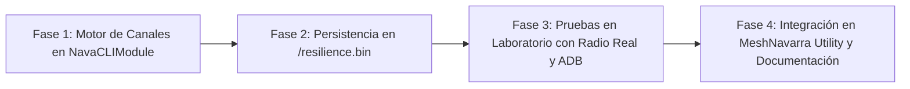

# 📡 PLAN DE TRABAJO: Canal Privado de Gestión y Redirección de NavaCLI (Frente F21)

> **Documento de Análisis de Viabilidad Técnica y Evaluación de Riesgos**  
> **Fecha:** 17 de Agosto de 2026  
> **Estado:** 📋 PROPUESTA / PLANIFICADO (Pendiente de aprobación del operador para ejecución)  
> **Módulo Implicado:** `src/modules/NavaCLIModule.cpp`, `src/mesh/Channels.cpp`, `src/modules/NavaCLIModule.h`

---

## 🎯 1. Objetivo y Necesidad

Actualmente, **NavaTastic** utiliza una arquitectura de canales fija:
* **Slot 0**: Canal Primario Mesh (`SFNarrow` / `LongFast`, público o compartido).
* **Slot 1 (`Navadmin`)**: Canal Secundario público con PSK `{0x01}` (`AQ==`), utilizado para:
  1. Recibir y responder los 13 comandos de consulta y diagnóstico público (`status`, `bat`, `env`, `peers`, etc.).
  2. Emitir los avisos automáticos de ciclo solar (`[Listo]`, `[Vivo]`, `[Critico]`, `[Sueño]`, `[Boot]`).

### 💡 La Propuesta del Operador:
Permitir que un administrador pueda, **a distancia por radio (mediante Mensaje Directo Privado)**:
1. **Crear o modificar un canal en un slot libre (slots 2 al 7)** con el nombre deseado y la clave de cifrado deseada (bien una clave estándar de 1 byte como `AQ==`/`Ag==` o una clave AES-128/AES-256 completa en base64).
2. **Redirigir NavaCLI hacia ese nuevo canal**: Indicar al repetidor que escuche y responda los comandos abiertos por ese canal privado y que emita allí los avisos solares.
3. **Silenciar o desactivar las respuestas por `Navadmin` (Slot 1)**: Para que usuarios ajenos a la gestión no puedan consultar métricas ni ver los avisos de energía en el canal público estándar.

### 🌟 BONUS AÑADIDO: Gestión Universal y Remota de Toda la Tabla de Canales
Este mecanismo **no se limita únicamente a NavaCLI**, sino que otorga al operador la **capacidad total de administrar a distancia cualquier canal de la malla**:
* **Despliegue de canales para grupos operativos**: Crear remotamente canales secundarios (ej. *Emergencias*, *Protección Civil*, *Eventos*, *Radioaficionados*) en los repetidores de una comarca para que retransmitan ese tráfico, sin tener que desplazarse físicamente con cable ni Bluetooth.
* **Canales de telemetría y sensores privados**: Habilitar canales dedicados a sensores ambientales I2C con contraseñas seguras AES-256 independientes.
* **Inspección y Limpieza Remota**: Consultar en cualquier momento qué canales están cargados en un repetidor de cumbre (`/nava ch_ls`) y borrar canales obsoletos o temporales (`/nava ch_del <slot>`).
* **Uso totalmente independiente**: El operador puede añadir y borrar canales secundarios para el uso de los usuarios normales **sin necesidad de vincularlos a NavaCLI** (NavaCLI puede seguir en Navadmin o donde el operador decida).

---

## 🔬 2. Análisis de Viabilidad Técnica

### ✅ Dictamen: **100% FACTIBLE Y VIABLE**

Meshtastic y la arquitectura modular de NavaTastic ya disponen de los cimientos necesarios:

| Componente | Estado Actual | Adaptación Requerida para F21 |
| :--- | :--- | :--- |
| **Capacidad de Canales (`channels.pb`)** | Meshtastic soporta **8 slots de canal** (índices 0 al 7). Los slots 2 a 7 están deshabilitados (`DISABLED`) por defecto. | Habilitar un slot asignando `role = SECONDARY`, `name` y `psk`. |
| **Motor Criptográfico (`CryptoEngine`)** | Soporta claves simétricas de 1 byte (`0x01`–`0xFF`), AES-128 (16 bytes) y AES-256 (32 bytes). | Cargar el array de bytes de la clave en `channel.settings.psk`. |
| **Filtrado de Entrada en `NavaCLIModule`** | Hardcodeado a `if (mp.channel == 1)`. | Parametrizar con una variable: `if (mp.channel == cliChannelSlot)`. |
| **Emisión de Avisos Solares** | Hardcodeado a `enqueueResponse(..., 1, ...)`. | Emitir al canal activo: `enqueueResponse(..., cliChannelSlot, ...)`. |
| **Persistencia (`/resilience.bin`)** | Guarda rol, químicos y claves de admin. | Ampliar `ResiliencePrefs` para almacenar `cliChannelSlot` (1 byte) y `navadminMuted` (1 byte). |

---

## ⚠️ 3. Evaluación de Riesgos y Estrategias de Mitigación

### 🔴 Riesgo 1: Peligro de "Aislamiento" o Bloqueo Lógico (Severidad: MEDIA / Impacto: BAJO)
* **Escenario**: El usuario redirige NavaCLI al Slot 2 con una contraseña compleja, silencia el Canal 1 (Navadmin) y posteriormente pierde u olvida la clave del Slot 2 en su móvil.
* **Mitigación Arquitectónica (Salva-vidas Garantizado)**:
  * Los comandos de administración ejecutiva **SIEMPRE viajan por Mensaje Directo Privado (DM)**. El DM viaja a nivel de red por el bus primario y no depende de ningún canal secundario.
  * Por tanto, un Administrador autorizado **NUNCA pierde el control del repetidor**: siempre puede enviar por DM el comando de rescate `/nava ch_reset` o `/nava set_cli_chan 1` para reactivar Navadmin al instante.

### 🟡 Riesgo 2: Longitud del Paquete LoRa (MTU) (Severidad: BAJA / Impacto: MEDIO)
* **Escenario**: Enviar en un solo mensaje de texto el comando, el número de slot, el nombre del canal y una clave AES-256 en base64 de 44 caracteres puede rozar el límite de longitud de paquete de Meshtastic si se hace en una sola orden compleja.
* **Mitigación**:
  * Diseñar una sintaxis compacta y eficiente:
    * Claves cortas: `/nava ch_set 2 MiCanal AQ==`
    * Claves largas AES-256: `/nava ch_set 2 MiCanal <clave_base64>`
    * O bien en dos pasos: `/nava ch_name 2 MiCanal` y `/nava ch_key 2 <clave_base64>`.

### 🟡 Riesgo 3: Supervivencia ante Resets de Configuración (Severidad: MEDIA / Impacto: MEDIO)
* **Escenario**: Si se ejecuta un `--factory-reset-config`, Meshtastic borra `channels.pb` y solo reconstruye el canal 0 y el canal 1 (Navadmin).
* **Mitigación (Patrón F20 / Bloque R)**:
  * Al igual que hicimos con las claves de administración y el rol `ROUTER`, los parámetros del canal privado personalizado (`slot`, `nombre` y `psk`) se respaldan en `/resilience.bin`.
  * Tras un reseteo de configuración, el firmware restaura automáticamente el canal secundario personalizado desde el archivo de resiliencia en LittleFS.

---

## 🛠️ 4. Catálogo de Comandos Propuestos (Sintaxis CLI)

Todos estos comandos se ejecutarían **exclusivamente por Mensaje Directo Privado (DM)** desde un nodo con clave pública autorizada:

### 📡 A. Gestión de Canales y Redirección
```text
1. /nava ch_ls
   -> Lista los 8 slots de canales, mostrando cuáles están activos, su nombre, tipo de clave (1-byte / AES-128 / AES-256) y estado de subida/bajada MQTT (Up/Down).

2. /nava ch_set <slot 2-7> <nombre> <psk_base64>
   -> Configura y activa un canal secundario en el slot indicado.
   -> Ejemplos:
      /nava ch_set 2 RedPrivada AQ==           (Clave publica estandar 1 byte)
      /nava ch_set 2 MiMalla K8RUGJsD7u...==   (Clave AES-256 de 32 bytes)

3. /nava ch_del <slot 2-7>
   -> Deshabilita el canal del slot seleccionado y libera la memoria.

4. /nava ch_url <slot 0-7>
   -> Genera la URL estandar de Meshtastic ('meshtastic.org/e/#...') para importar el canal en la app del movil con 1 toque.

5. /nava set_cli_chan <slot 1-7>
   -> Redirige la escucha de consultas de NavaCLI y la emision de avisos solares al slot elegido (por defecto: 1).

6. /nava navadmin_mute [on/off]
   -> 'on': Silencia el Canal 1 (Navadmin); el repetidor ya no responde a consultas publicas ni emite avisos por Navadmin.
   -> 'off': Restaura el comportamiento publico estandar por Canal 1.

7. /nava ch_reset
   -> Orden de rescate: restaura la configuracion de fabrica de canales (Slot 1 Navadmin activo y NavaCLI asignado al Slot 1).
```

### 🌐 B. Control de Compuerta y Visibilidad MQTT (Uplink / Downlink / OkToMQTT)
> **Utilidad**: Permite subir la telemetría del repetidor a internet vía MQTT (`uplink_enabled`) sin saturar el canal de radio LoRa con mensajes entrantes desde internet (`downlink_enabled`), o autorizar a pasarelas ajenas a subir nuestros paquetes.

```text
8. /nava ch_mqtt <slot 0-7> [up | down | both | off]
   -> 'up': Solo subida (los paquetes LoRa se envian a MQTT; nada entra de MQTT a la radio).
   -> 'down': Solo bajada (los mensajes de internet se retransmiten a la radio).
   -> 'both': Subida y bajada bidireccional activas.
   -> 'off': Canal totalmente aislado de la pasarela MQTT.

9. /nava set_ok_to_mqtt [on | off]
   -> 'on': Marca el bit 'OK_TO_MQTT' en todos los paquetes emitidos por este repetidor, autorizando a pasarelas/gateways de la red a subirlos a internet para que el nodo aparezca en mapas web de cobertura (ej. meshmap / loranavarra).
   -> 'off': Desactiva el permiso de subida por terceros (mantiene la actividad del repetidor confinada 100% en radio local).
```

### 🛰️ C. Funciones Avanzadas de Infraestructura de Montaña (Extras Útiles)
```text
9. /nava set_pos <latitud> <longitud> <altitud>
   -> Fija o corrige las coordenadas GPS estaticas en repetidores de cumbre que no disponen de modulo GPS fisico, posicionandolos en los mapas de cobertura web.

10. /nava set_beacon <minutos>
   -> Ajusta el intervalo de emision de la baliza de NodeInfo/Posicion (ej. cada 180 min en cumbres aisladas para ahorrar bateria y no saturar el aire, o cada 30 min en eventos).

11. /nava mute [minutos]
   -> Silenciado temporal de retransmision LoRa (el repetidor no retransmite paquetes ajenos durante X minutos para auditar la cobertura de repetidores vecinos, recuperando el servicio automaticamente).
```

---

## 📅 5. Plan de Ejecución por Fases (Estimación Técnica)



1. **Fase 1 (Código Core)**: Implementar funciones `handleChannelConfig()` en `NavaCLIModule.cpp` interactuando con `channels.setChannel()` y `channels.saveChannels()`.
2. **Fase 2 (Persistencia Semi-Permanente)**: Añadir estructura de persistencia en `ResiliencePrefs` para recrear el canal tras factory reset.
3. **Fase 3 (Validación en Banco)**: Probar con Faketec Slave + Master por radio: creación de canal AES-256, redirección de avisos `[Listo]`/`[Sueño]` al canal privado y verificación del silencio en Navadmin.
4. **Fase 4 (App & Documentación)**: Añadir botones de gestión de canal en la app MeshNavarra Utility y actualizar manuales.

---

## 📌 Conclusión y Recomendación

La funcionalidad es **técnicamente impecable, muy útil para redes privadas o de emergencias** que deseen mantener el repetidor totalmente oculto en el canal público Navadmin, y su riesgo de fallo es prácticamente nulo gracias a que la vía de administración por DM nunca se ve afectada.

Este documento queda registrado como **Frente F21** para cuando el operador decida iniciar su desarrollo.
