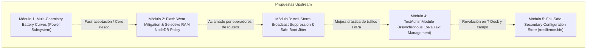

# PLAN MAESTRO: PROPUESTAS MODULARES PARA MESHTASTIC UPSTREAM
## Análisis Comparativo: NavaTastic V4 vs. Meshtastic 2.7.26 vs. Meshtastic 2.8.0 (Develop)

---

## 0. Resumen Ejecutivo y Visión Estratégica

**NavaTastic V4** es un fork especializado de Meshtastic 2.7.26 diseñado tras cientos de horas de pruebas de laboratorio y despliegues en condiciones extremas de montaña en Navarra (España). 

El firmware oficial de Meshtastic fue concebido históricamente para redes pequeñas y medianas (decenas de nodos) con enlaces punto a punto o pocos saltos, gestionadas interactivamente a través de una aplicación móvil por Bluetooth. Cuando una red crece hasta convertirse en una **mega-malla de cientos o miles de nodos (>2.000 nodos)**, con repetidores solares en cumbres y alta latencia por saltos múltiples, la arquitectura estándar de Meshtastic colapsa por cuatro motivos críticos:
1. **Tormentas de difusiones (*Broadcast Storms*)**: Respuestas masivas simultáneas a peticiones de NodeInfo que saturan el espectro LoRa (ancho de banda 62.5 kHz) durante minutos.
2. **Degradación física de memoria Flash**: Cada paquete recibido escribe en el sistema de archivos LittleFS (`db.proto`), quemando la memoria de los microcontroladores en repetidores de alto tráfico.
3. **Muerte por *Timeouts* en la App Móvil**: La administración interactiva por Protobuf binario exige sesiones síncronas de ida y vuelta que fallan sistemáticamente ante latencias de más de 10 segundos en mallas densas.
4. **Nodos "Ladrillo" por Cortes Solares o Corrupción**: La falta de un almacén secundario atómico de rescate (`/resilience.bin`) provoca la pérdida de claves de administración y canales tras reseteos imprevistos o bajadas de tensión invernales.

Este documento presenta el análisis técnico completo de las mejoras de NavaTastic, desglosadas en **módulos independientes y listos para ser propuestos como RFCs / Pull Requests al repositorio oficial de Meshtastic (`meshtastic/firmware`)**, junto con una comparativa detallada frente al futuro **Meshtastic 2.8.0**.

---

## 1. ¿Qué es Meshtastic 2.8.0 y qué novedades aporta frente a 2.7.26?

Meshtastic **v2.8.0** es la próxima versión mayor en desarrollo activo (rama *develop* / *nightlies*). Está orientada a resolver problemas de tráfico y compatibilidad táctica (ATAK/TAK), pero se encuentra en fase de pruebas intensivas y presenta diversos desafíos de estabilidad.

### 🌟 Novedades Principales de Meshtastic 2.8.0 explicadas en lenguaje claro:

| Módulo / Novedad en 2.8.0 | ¿Para qué sirve? (Explicación sencilla) | Problemas / Retos actuales en desarrollo |
| :--- | :--- | :--- |
| **1. Traffic Management Module (Módulo de Gestión de Tráfico)** | Es un "policía de tráfico" en el nodo. Evalúa la congestión del canal (*chutil*) y, si la red está saturada, frena automáticamente la frecuencia con la que los nodos mandan su posición GPS. También descarta paquetes que hayan agotado sus saltos (*hop-exhaustion*) y añade una caché rápida de 3er nivel. | Genera sobrecarga de CPU en microcontroladores pequeños y a veces descarta paquetes legítimos en mallas con topologías complejas. |
| **2. Rediseño y Desacoplamiento de NodeDB** | Intenta dividir la base de datos de nodos en capas más pequeñas y añade un almacenamiento "templado" (*warm-store*) para que dispositivos con poca RAM (nRF52) no colapsen cuando la lista de nodos crece. | Problemas de sincronización con la App móvil; si la caché en RAM no coincide con la flash, los nombres de nodos parpadean o aparecen como "Unknown". |
| **3. Firma Criptográfica XEdDSA de Paquetes** | Permite que cada mensaje de texto lleve una firma digital infalsificable del emisor. En la App aparece un "escudo verde" que demuestra que nadie ha suplantado la identidad del nodo emisor. | Aumenta el tamaño en bytes de cada paquete (*airtime*), lo que incrementa el tiempo de transmisión LoRa y el riesgo de colisiones en canales lentos (SFNarrow). |
| **4. Integración Táctica TAK V2 (Cursor-on-Target)** | Soporte nativo para el formato de cable TAK V2, permitiendo interoperabilidad completa con aplicaciones militares/de rescate como ATAK e iTAK (rutas, polígonos de búsqueda, balizas de emergencia CASEVAC). | Aumenta notablemente el consumo de memoria Flash y RAM en placas que no usan ATAK. |
| **5. Balizas de Red (*Mesh Beacons*) y PLI Estable** | Permite a los repetidores emitir balizas periódicas de identificación para mapeo de cobertura de forma estandarizada. | Requiere coordinación cuidadosa para no saturar canales ya congestionados. |
| **6. Optimizaciones de Memoria en nRF52 (Heap Tiers)** | Correcciones en el tamaño del *heap* de FreeRTOS para nRF52 y gestión del ciclo de vida de la pila Bluetooth BLE para evitar reinicios por falta de memoria. | Aún en depuración ante emparejamientos BLE concurrentes. |

---

## 2. Matriz Comparativa Exhaustiva: NavaTastic V4 vs. Meshtastic 2.7.26 vs. Meshtastic 2.8.0

| Área / Funcionalidad | Meshtastic 2.7.26 (Pristine) | Meshtastic 2.8.0 (Develop) | NavaTastic V4 (Nuestro Fork) | Ventaja Clave de NavaTastic en Grandes Mallas |
| :--- | :--- | :--- | :--- | :--- |
| **Administración Remota en Campo** | Síncrona por Protobuf binario (`ADMIN_APP`). Falla por timeouts en mallas de >2 saltos. | Síncrona por Protobuf binario + acciones remotas de hora. Mismos timeouts en app. | **Asíncrona por Texto (`NavaCLI`)** vía DM PKI. "Dispara y olvida" con acuse de recibo. | **100% tolerante a latencia**. Permite administrar desde T-Deck, CardKB o chat sin abrir la app. |
| **Consumo y Desgaste de Flash** | Escribe cada paquete recibido en Flash (`db.proto`). Alto desgaste físico en repetidores. | Intenta desacoplar estructuras (*warm-store*), pero sigue requiriendo persistencia en disco. | **`NodeDB RAM-Only`**: Nodos de paso viven en RAM. Solo guarda propios, favoritos y admins. | **Reduce las escrituras en Flash en un 99%**. Protege la vida física del repetidor durante décadas. |
| **Control de Tormentas (*Anti-Storm*)** | `want_response` provoca respuestas simultáneas en broadcast de todos los nodos vecinos. | Control de congestión para posiciones GPS en el nuevo módulo de tráfico. | **Supresión de avalanchas al boot** (`currentGeneration = radioGeneration`) y difusiones a 72h. | **Evita el colapso del canal LoRa**. Los repetidores no saturan la malla al encenderse. |
| **Resiliencia ante Resets y Corrupción** | Un reset de fábrica borra claves admin, roles y canales. El repetidor queda huérfano. | Añadido "Lockdown Mode" parcial, pero sin almacén atómico secundario de rescate. | **Almacén Atómico `/resilience.bin` (V5 `NAV5`)**: Claves admin, rol y química inmunes a reset. | **Imposible perder el control remoto**. Clave de rescate auto-inyectada en boot si la flash se corrompe. |
| **Gestión Multi-Química de Batería** | Curva fija de LiPo (4.2V - 3.0V). Incompatible con NiMH o LiFePO4. | Curva fija de LiPo genérica en `Power.cpp`. | **Tablas OCV Multi-Química dinámicas**: LiPo, NiMH (3S/4S), LiFePO4 y Sodium con `/nava set_chem`. | **Protección real contra descarga profunda** y cálculo de porcentaje exacto según la batería instalada. |
| **Protección Anti-Brownout Solar** | Si amanece nublado, el nodo arranca, consume un pico de corriente, cae el voltaje y entra en bucle. | Sin pre-check multi-muestreo antes de encender la radio. | **Filtro Anti-Brownout en `setup()`**: 5 lecturas de VDD y retardo de 3s antes de radio + POFCON 2.2V. | **Garantiza un arranque limpio** en repetidores solares desatendidos en cumbres. |
| **Descubrimiento de Repetidores Directos** | Manual o pasivo en la lista general. | Enrutamiento por saltos con métricas de tráfico. | **`RAM Auto-Favorite`**: Detecta repetidores directos a 0 saltos y los marca automáticamente. | **Mapeo inmediato de la infraestructura troncal** (*backbone*) de la red local. |
| **Acreditación Criptográfica en Caliente** | Si un admin cambia de clave, el nodo rechaza el NodeInfo y bloquea la comunicación (bucle de desconfianza). | Firma XEdDSA en desarrollo. | **Fix Criptográfico H3 (a)+(a2)** en `updateUser`: Acreditación inmediata con un solo broadcast. | **Actualización de claves de mando en campo sin tocar físicamente los repetidores**. |
| **Blindaje de Canales de Rescate** | Cualquier usuario con acceso admin puede borrar el canal 0 o 1 por descuido. | Canales borrables según permisos. | **Inamovilidad de Slot 1 (*Navadmin*)**: Rechazo de `ch_del 1` con error `ERR: SLOT INVALIDO`. | **El canal de rescate nunca se pierde**, garantizando siempre una vía de acceso de emergencia. |

---

## 3. Desglose Modular de Propuestas para Meshtastic Upstream

Para maximizar la probabilidad de aceptación por parte del equipo de Meshtastic, las mejoras de NavaTastic se estructuran en **5 Propuestas Modulares Independientes**:

---

### 📦 Módulo 1: *Multi-Chemistry Battery OCV Curves in Power Subsystem*
* **Objetivo**: Permitir que cualquier nodo Meshtastic (solar, portátil o industrial) calcule correctamente su porcentaje de batería y aplique umbrales de bajo consumo según la química química real de su celda (LiPo, LiFePO4, NiMH, Sodium-Ion).
* **Ficheros a modificar**:
  * `src/mesh/Power.cpp` y `src/power.h`
  * `protobufs/meshtastic/config.proto` (añadir enum `BatteryChemistry` en `PowerConfig`)
* **Cambios Técnicos**:
  * Sustituir el array estático hardcodeado en `Power.cpp` por tablas OCV (*Open Circuit Voltage*) seleccionables por software.
  * Añadir métodos virtuales `updateOcvCurve()` y `setChemistryProfile()` en `HasBatteryLevel`.
* **Compatibilidad**: **100% Multiplataforma** (ESP32, nRF52, RP2040, STM32).
* **Argumento para Upstream**: "Permite alimentar nodos con bancos LiFePO4 de alta durabilidad o 4 pilas NiMH en frío extremo sin que el nodo reporte 0% de batería ni se apague erróneamente".

---

### 📦 Módulo 2: *Flash Wear Mitigation & Selective RAM NodeDB Storage Policy*
* **Objetivo**: Proteger los sectores físicos de la memoria Flash en repetidores comunitarios con alto volumen de tráfico, almacenando los nodos en tránsito en memoria RAM y persistiendo en disco únicamente nodos críticos.
* **Ficheros a modificar**:
  * `src/mesh/NodeDB.cpp` y `src/mesh/NodeDB.h`
  * `protobufs/meshtastic/config.proto` (añadir `node_db_policy` en `DeviceConfig`)
* **Cambios Técnicos**:
  * En `NodeDB::saveNodeDatabaseToDisk()`, aplicar un filtro de serialización: solo guardar propio nodo (`is_my_node`), favoritos (`is_favorite`), administradores verificados (`isAdminNode()`) y nodos de infraestructura directa.
  * Desalojo híbrido inteligente en `getOrCreateMeshNode()`: si la tabla de 80 nodos se llena, desalojar el nodo transeúnte más antiguo sin desbordar el array.
* **Compatibilidad**: **100% Multiplataforma** (cualquier placa con LittleFS o SPIFFS).
* **Argumento para Upstream**: "Elimina el desgaste prematuro de chips Flash en routers de montaña y previene corrupciones del sistema de archivos tras tormentas de paquetes".

---

### 📦 Módulo 3: *Anti-Storm Broadcast Engine & Boot Jitter Suppression*
* **Objetivo**: Eliminar las tormentas destructivas de paquetes en el aire producidas cuando un nodo solicita confirmación de NodeInfo o tras el reinicio de repetidores.
* **Ficheros a modificar**:
  * `src/modules/NodeInfoModule.cpp`
  * `src/mesh/Router.cpp`
* **Cambios Técnicos**:
  * Igualar `currentGeneration = radioGeneration` en el constructor de `NodeInfoModule` para suprimir la petición de respuesta masiva en el arranque.
  * Extender la supresión de respuestas repetidas mediante `Throttle::isWithinTimespanMs()` y elevar el intervalo de difusión de NodeInfo por defecto a valores sostenibles en routers (72 horas).
* **Compatibilidad**: **100% Multiplataforma**.
* **Argumento para Upstream**: "Reduce drásticamente el *airtime* consumido en canales de ancho de banda estrecho (SFNarrow / 62.5 kHz) y estabiliza redes de más de 500 nodos".

---

### 📦 Módulo 4: *TextAdminModule (Lightweight Remote Text Administration & Triage)*
* **Objetivo**: Proveer una interfaz de administración y diagnóstico remoto en texto plano asíncrono que funcione directamente sobre cualquier cliente de chat LoRa sin depender de la App móvil por Bluetooth ni sufrir *timeouts* de conexión.
* **Ficheros a modificar**:
  * `src/modules/TextAdminModule.h` y `src/modules/TextAdminModule.cpp` (Nuevo módulo heredado de `SinglePortModule`)
  * `src/modules/Modules.cpp`
* **Cambios Técnicos**:
  * Interceptar mensajes entrantes por DM cifrado (`mp.pki_encrypted`).
  * Validar criptográficamente la clave pública del emisor contra `config.security.admin_key[0..2]`.
  * Ejecutar comandos atómicos (`/cmd ping`, `/cmd status`, `/cmd bat`, `/cmd noise`, `/cmd rxlog`, `/cmd set_hops <n>`, `/cmd mute <min>`, `/cmd reboot`) y devolver respuestas concisas fragmentadas a $\le 190$ caracteres.
* **Compatibilidad**: **100% Multiplataforma** (ESP32, nRF52, RP2040, STM32, Linux).
* **Argumento para Upstream**: "Permite administrar repetidores remotos desde dispositivos autónomos con teclado (LilyGO T-Deck, CardKB) y operar en mallas de alta latencia donde la app oficial se congela".

---

### 📦 Módulo 5: *Fail-Safe Secondary Configuration Store (`/resilience.bin`)*
* **Objetivo**: Garantizar que un repetidor en una ubicación remota nunca quede inaccesible ni huérfano tras un fallo eléctrico, corrupción de LittleFS o reseteo accidental.
* **Ficheros a modificar**:
  * `src/mesh/NodeDB.cpp`
  * `src/modules/AdminModule.cpp`
* **Cambios Técnicos**:
  * Creación de una estructura binaria atómica con número mágico y suma de comprobación (`NAV5`).
  * Almacenar de forma redundante las claves públicas de administración, el rol del dispositivo y los parámetros críticos de radio.
  * En `NodeDB::loadFromDisk()`, si `local_sum == 0` (flash en blanco), auto-recuperar las claves por defecto desde el almacén de seguridad.
  * Inamovilidad lógica del canal secundario de administración.
* **Compatibilidad**: Microcontroladores con sistema de archivos LittleFS.
* **Argumento para Upstream**: "Aporta tolerancia a fallos de grado industrial para infraestructuras críticas de emergencia y repetidores solares desatendidos".

---

## 4. Estrategia y Hoja de Ruta para Presentar las Propuestas

Para garantizar una recepción positiva y evitar rechazos por falta de contexto:

1. **Fase 1: Presentación Comunitaria (GitHub Discussions / Meshtastic Discord)**
   * Publicar hilos de debate técnico en la categoría *RFC / Feature Ideas* de Meshtastic.
   * Aportar datos reales de la red de Navarra: comportamiento en mallas de largo alcance, ahorro de batería y estabilidad de enlaces.
2. **Fase 2: Envío Progresivo de Pull Requests (Una a Una)**
   * **PR #1**: *Multi-Chemistry Battery Curves* (Código pequeño, puramente algorítmico, riesgo cero).
   * **PR #2**: *Flash Wear Mitigation for Routers* (Muy demandado por operadores de repetidores).
   * **PR #3**: *Anti-Storm Broadcast Fixes* (Mejora directa para el tráfico LoRa mundial).
   * **PR #4**: *TextAdminModule* (Como módulo opcional habilitable en `platformio.ini`).
3. **Fase 3: Mantenimiento del Fork NavaTastic como "Edición de Vanguardia"**
   * Mientras el equipo oficial evalúa e incorpora estos módulos a su ritmo (que puede llevar varios meses), **NavaTastic V4 continúa funcionando en producción como la versión más robusta y optimizada del mercado**.

---
*Documento técnico de arquitectura elaborado para la consolidación y transferencia tecnológica de NavaTastic V4 a la comunidad de código abierto de Meshtastic.*
