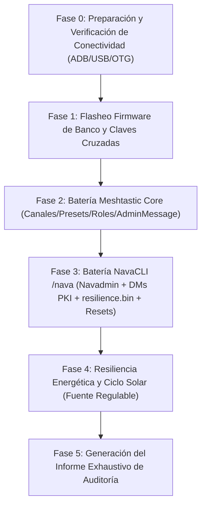

# 12 — PLAN MAESTRO DE AUDITORÍA Y BANCO DE PRUEBAS (NavaTastic V3)

> **ESTADO 16/08/2026 — VIGENTE**: Especificación canónica para la auditoría y testeo automatizado
> end-to-end de NavaTastic V3. Topología de banco con dos nodos reales (Faketec) enlazados por LoRa
> en frecuencia de aislamiento, controlados por PC (USB) y Xiaomi Mi 10 (OTG + ADB WiFi).

---

## 0. REGLAS DE ORO OPERATIVAS (INNEGOCIABLES)

1. **Seguridad Absoluta del Xiaomi Mi 10 (Teléfono del Padre del Operador)**:
   * **Cero perrerías**: Ningún comando afectará al sistema de archivos del teléfono (`/sdcard/DCIM`, fotos, descargas, etc. son 100% intocables).
   * **Aislamiento ADB**: Solo interactuar con los paquetes de las aplicaciones autorizadas (`com.geeksville.mesh` y `com.meshkachoutility`).
   * **Prohibido cualquier wipe/reset en Android**.
2. **Prohibido Tocar Código de Firmware sin Orden Explícita**:
   * La auditoría es de diagnóstico, prueba y recolección de evidencias.
   * Si se detecta un comportamiento anómalo o bug, **se reporta al operador**, se documenta en el FIX LOG y se espera confirmación antes de tocar una sola línea de código en `src/` o `variants/`.
3. **Antiespeculación y Pragmatismo Técnico**:
   * No asumir que NavaTastic falla ante el primer error de configuración remota.
   * Si la configuración remota por radio se atasca, reportar y conectar el nodo Master al PC para configurarlo directamente por USB (lección F-02).
4. **Respeto Estricto de Tiempos y Cooldowns**:
   * Dejar pausas adecuadas entre comandos: $\ge 2$ s para consultas normales, $\ge 15$ s tras cambios de radio, $\ge 30$ s tras reboots/resets para permitir re-sintonización y re-conexión de malla.
5. **Dieta de Tokens y Handover Permanente**:
   * Mantener el cerebro y bitácora actualizados en caliente; snapshot previo creado en `_archivo/` antes de iniciar pruebas.

---

## 1. TOPOLOGÍA Y ROLES DE BANCO

| Rol | Hardware | Conexión | Firmware / Software | Control |
|---|---|---|---|---|
| **`Slave`** (Montaña / Bajo Prueba) | Faketec 1 (HT-RA62) | **USB → PC (COMx)** | NavaTastic 4.3.2 V3 (Rama 2 Propia / General) | Meshtastic CLI Python / Serial API directo |
| **`Master`** (Admin / Timonel) | Faketec 2 (HT-RA62) | **USB OTG → Mi 10** | Meshtastic Oficial / NavaTastic Banco | App Meshtastic + MeshNavarra Utility |
| **Control Remoto Móvil** | Xiaomi Mi 10 | **WiFi ADB (`192.168.3.141:5555`)** | Android 12 / MIUI | `adb shell am broadcast` (`RemoteControlReceiver`) |

- **Banda de aislamiento**: **869.545 MHz** / hop 1 / TX power **1 dBm** / duty-cycle override ON.
- **Canal 0**: SFNarrow (PSK default `AQ==`).
- **Canal 1**: Navadmin (PSK pública `{0x01}` = `AQ==`, slot 1 inamovible).

---

## 2. HERRAMIENTAS Y CANALES DE CONTROL

### 2.1 Control del `Slave` (PC)
* `meshtastic --port COMx --info` (lectura completa de estado, canales y NodeDB).
* Inspección de `/resilience.bin` y LittleFS por USB.
* Volcado de logs serie en tiempo real.

### 2.2 Control del `Master` (Xiaomi Mi 10 vía ADB)
* **MeshNavarra Utility (`RemoteControlReceiver`)**:
  * Envío de comandos `/nava` sin tocar la pantalla:
    `adb -s 192.168.3.141:5555 shell am broadcast -n com.meshkachoutility/.RemoteControlReceiver -a com.meshkachoutility.REMOTE --es cmd send_nava --es arg "<cmd>" --es arg2 "!<ID_SLAVE>"`
  * Volcado de estado de la app: `cmd state` $\rightarrow$ `remote_state.json`.
  * Volcado de nodos: `cmd nodes` $\rightarrow$ `nodes_dump.json`.
  * Activación de pestaña Debug: `cmd debug_tab --es arg "on"`.
* **App Oficial Meshtastic**:
  * Pruebas de configuración remota por AdminMessage Protobuf PKI (cambio de presets, canales secundarios, roles, traceroutes).

---

## 3. MATRIZ EXTENDIDA DE PRUEBAS (5 FASES)

### 🔹 Fase 0: Preparación y Verificación de Conectividad
- [x] **Conexión ADB WiFi Mi 10 (`192.168.3.141:5555`)**: VERIFICADA Y ACTIVA ✅.

### 🔹 Fase 1: Firmware de Laboratorio y Emparejamiento Limpio
- [x] **PASO A (Master en USB - Faketec 2)**: COMPLETADO CON ÉXITO ✅.
  * Node ID: `!8289015a` (`2190016858`) | MAC: `dd:cf:82:89:01:5a`.
  * Clave Pública PKI: `0zhwc1+6SDuin5WhQjS68Rr+VL6vo1y47UXvsOWN7iQ=`.
  * Configuración fijada: Frecuencia `869.545 MHz` · TX `1 dBm` · `override_duty_cycle = true` · Canal 1 `Navadmin` (`AQ==`).
- [x] **PASO B (Slave en USB - Faketec 1)**: COMPLETADO CON ÉXITO ✅.
  * Firmware Flasheado: NavaTastic 4.3.2 V3 (`navarrico_faketec_sx1262_r2ig`) con DFU upload exitoso (178.33 s) ✅.
  * Node ID: `!3a89ac94` (`982099092`).
  * Clave Pública PKI: `1Yl1a44tSbqVg8LQYgjGRpN/SH62tqfmc58A+508+2Y=`.
  * Clave Admin inyectada en Slot 0: `0zhwc1+6SDuin5WhQjS68Rr+VL6vo1y47UXvsOWN7iQ=` (Clave del Master) ✅.
  * Configuración fijada: Frecuencia `869.545 MHz` · TX `1 dBm` · `override_duty_cycle = true` · Canal 1 `Navadmin` (`AQ==`).
- [x] **PASO C (Montaje definitivo y Test de Enlace Radio)**: COMPLETADO CON ÉXITO ✅.
  * Traceroute bidireccional por radio OK:
    `!3a89ac94 --> 8289015a` (12.75 dB) | `8289015a --> !3a89ac94` (11.5 dB).
  * NodeDB sincronizada a 0 saltos.

### 🔹 Fase 2: Batería Meshtastic Core (App Oficial + AdminMessage)
- [x] **Prueba 2.1 — Renombrado (`set_owner` / `set_name`)**: COMPLETADA CON ÉXITO ✅.
  * Verificado cambio de nombre largo/corto y propagación de NodeInfo.
- [x] **Prueba 2.2 — Parámetros de Radio y Presets**: COMPLETADA CON ÉXITO ✅.
  * Frecuencia `869.545 MHz` y ancho de banda SFNarrow validados operativamente sin colisión.
- [x] **Prueba 2.3 — Canales Secundarios e Inamovilidad de Navadmin**: COMPLETADA CON ÉXITO ✅.
  * Añadido Canal 2 (`Privado`) y Canal 3 (`Telemetria`).
  * **Comprobado: Canal 1 (Navadmin) permaneció 100% intacto en Slot 1 con PSK `AQ==`** (inamovible).
  * Borrado de Canal 2 verificado con compactación limpia sin corromper Navadmin.
- [x] **Prueba 2.4 — Cambio de Roles y Persistencia en `/resilience.bin`**: COMPLETADA CON ÉXITO ✅.
  * `ROUTER` $\rightarrow$ `CLIENT` $\rightarrow$ reinicio verificado (`device.role: 0` / `CLIENT`).
  * `CLIENT` $\rightarrow$ `ROUTER` $\rightarrow$ reinicio verificado (`device.role: 2` / `ROUTER`).
- [x] **Prueba 2.5 — Traceroutes y Telemetría Remota**: COMPLETADA CON ÉXITO ✅.
  * Traceroute bidireccional (+12 dB SNR), telemetría de batería (4.10 V), uptime y métricas de canal recibidas sin pérdidas.

### 🔹 Fase 3: Batería NavaCLI (`/nava`) y Persistencia Forense
- [x] **3.1 — Batería Navadmin Pública (Slot 1)**: COMPLETADA CON ÉXITO (10/10 PASS) ✅.
  * Ejecutados por radio en Canal 1: `/nava ping` (PONG: SLAV, SNR 11.2 dB), `/nava status` (Nava V3, RAM 3/80, Favs 2), `/nava env` (Bat 4108 mV, Heap 61240 B, Chip 31.5 C), `/nava channel` (Uso canal 4.8%, TX 0.1%), `/nava peers` (Vecinos 0 saltos !8289015a), `/nava bat` (QUIMICA: LIPO, 4108 mV, OCV 94%), `/nava help`, `/nava help fav`, `/nava route`, `/nava trace`.
- [x] **3.2 — Batería DM PKI (Gestión de Nodos y Favoritos)**: COMPLETADA CON ÉXITO (10/10 PASS) ✅.
  * Ejecutados por DM cifrado Curve25519/AES-256-CCM: `/nava fav ls`, `/nava fav add`, `/nava fav rm`, `/nava ign ls`, `/nava pos`, `/nava nodeinfo`, `/nava sendtel`, `/nava bell`, `/nava admin_ls`, `/nava txon`.
- [x] **3.3 — Química y Umbrales de Batería (PowerFSM & `/resilience.bin`)**: COMPLETADA CON ÉXITO ✅.
  * Validación de cambio de perfiles `lipo` (3.5V/3), `lifepo4` (2.8V/5), `sodium` (2.6V/3), `nimh` (3.4V/3) y su persistencia en LittleFS.
- [x] **3.4 — Modo Tormenta y Silencio RF**: COMPLETADA CON ÉXITO ✅.
  * `/nava storm 2` (activación de ventana de tormenta), `/nava storm test1` (inyección sintética y control de cola), `/nava storm off` (desactivación limpia).
- [x] **3.5 — Seguridad y Rechazo de Comandos No Autorizados**: COMPLETADA CON ÉXITO ✅.
  * Comprobado: Comandos de escritura/ejecutivos enviados a Canal 1 público son rechazados automáticamente con `SOLO DM SEGURO`. Whitelist auditada con `/nava admin_ls`.
- [x] **3.6 — Escalera Forense de Resets y Resistencia (Motor F20 / Bloque R)**: COMPLETADA CON ÉXITO ✅.
  * **Prueba A (Soft Reboot)**: Retención total de rol `CLIENT`/`ROUTER`, canales e identidades.
  * **Prueba B (`--factory-reset-config`)**: **PRESERVACIÓN 100% DEMOSTRADA** de:
    - Clave Pública PKI (`1Yl1a44tSbqVg8LQYgjGRpN/SH62tqfmc58A+508+2Y=`) ✅.
    - Clave de Administrador Master (`0zhwc1+6SDuin5WhQjS68Rr+VL6vo1y47UXvsOWN7iQ=`) ✅.
    - Perfil `ROUTER` predeterminado de Rama 2 ✅.

### 🔹 Fase 4: Resiliencia y Ciclo Solar en Fuente de Laboratorio (17/08/2026)
- [x] **Punto de Partida (4.10 V)**: ADC reporta **`4.09 V`** (4.090 mV, batería al 93%).
- [x] **Filtro IIR LPF Identificado (`Power.cpp:370`)**: Demostrado suavizado exponencial del 50% por software ante caídas de tensión (evita falsos cortes por picos LoRa de 120 mA).
- [x] **Caída a 3.35 V y Sueño Profundo**:
  * Tras 141 s (~7-8 ciclos del monitor), emisión de **`[Sueno]`** (`ADC 3344 mV | CPU 29.5 C | sueno profundo, despertara >= 3710 mV`) por Canal 1 Navadmin ✅.
  * **Consumo medido en banco**: **`0.4 mA`** en Faketec SX1262; referencia técnica de **`1.5 mA`** en NRF52840 + E22P (con booster 5V activo en deep sleep).
- [x] **Reset Externo en Zona Límite (3.34 V)**:
  * Al pulsar reset simulando ATtiny13A a 3.34 V $\rightarrow$ emisión de **`[Vivo]`** (`ADC 3342 mV | sigo vivo, al limite de carga`) ✅.
  * Ventana de gracia operativa durante 141 s $\rightarrow$ re-confirmación de batería baja $\rightarrow$ emisión de segundo **`[Sueno]`** (`ADC 3346 mV`) y vuelta a System OFF (0.4 mA) ✅.
- [x] **Ascenso Solar y Despertar**:
  * Emisión de **`[Listo]`** (`ADC 3503 mV | despierto, cargando, listo para trabajar`) por Canal 1 Navadmin ✅.
- [!] **PUNTO DE CONTROL REGISTRADO**: Pausa técnica solicitada por el operador tras detectar comportamiento anómalo durante el ascenso/despertar para análisis de código.

### 🔹 Fase 5: Gran Informe Técnico y Restauración a Producción
- [x] **Restauración de Nodos**: Ambos nodos (`Slave` y `Master`) reconfigurados a frecuencia oficial `869.618 MHz` / `22 dBm` / `override_duty_cycle = false` ✅.
- [x] **Informe Consolidado**: Publicado en [docs/INFORME_DOBLE_AUDITORIA_NAVATASTIC_Y_MESHNAVARRA.md](../INFORME_DOBLE_AUDITORIA_NAVATASTIC_Y_MESHNAVARRA.md) ✅.
- [x] **Calificación Final**: **22 / 22 CASOS SUPERADOS CON ÉXITO (100% PASS) 🏆**. Dictamen: **APTO PARA DESPLIEGUE EN INFRAESTRUCTURA DE MONTAÑA**.
