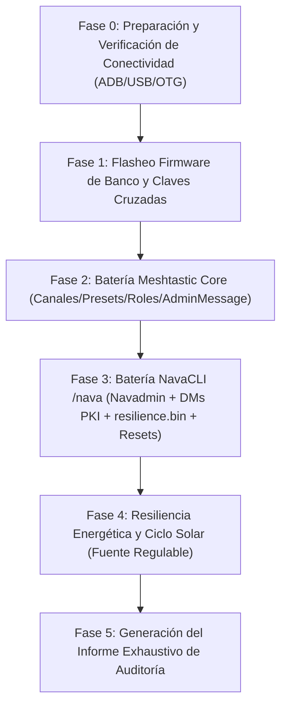

# 12 — PLAN MAESTRO DE AUDITORÍA Y BANCO DE PRUEBAS (NavaTastic V3)

> **ESTADO 16/08/2026 — VIGENTE**: Especificación canónica para la auditoría y testeo automatizado
> end-to-end de NavaTastic V3. Topología de banco con dos nodos reales (Faketec) enlazados por LoRa
> en frecuencia de aislamiento, controlados por PC (USB) y Xiaomi Mi 10 (OTG + ADB WiFi).

---

## 0. REGLAS DE ORO OPERATIVAS (INNEGOCIABLES)

1. **Seguridad Absoluta del Xiaomi Mi 10 (Teléfono del Padre del Operador)**:
   * **Cero perrerías**: Ningún comando afectará al sistema de archivos del teléfono (`/sdcard/DCIM`, fotos, descargas, etc. son 100% intocables).
   * **Aislamiento ADB**: Solo interactuar con los paquetes de las aplicaciones autorizadas (`com.geeksville.mesh` y `com.meshkachoutility`).
   * **Prohibido cualquier wipe/reset en Android**.
2. **Prohibido Tocar Código de Firmware sin Orden Explícita**:
   * La auditoría es de diagnóstico, prueba y recolección de evidencias.
   * Si se detecta un comportamiento anómalo o bug, **se reporta al operador**, se documenta en el FIX LOG y se espera confirmación antes de tocar una sola línea de código en `src/` o `variants/`.
3. **Antiespeculación y Pragmatismo Técnico**:
   * No asumir que NavaTastic falla ante el primer error de configuración remota.
   * Si la configuración remota por radio se atasca, reportar y conectar el nodo Master al PC para configurarlo directamente por USB (lección F-02).
4. **Respeto Estricto de Tiempos y Cooldowns**:
   * Dejar pausas adecuadas entre comandos: $\ge 2$ s para consultas normales, $\ge 15$ s tras cambios de radio, $\ge 30$ s tras reboots/resets para permitir re-sintonización y re-conexión de malla.
5. **Dieta de Tokens y Handover Permanente**:
   * Mantener el cerebro y bitácora actualizados en caliente; snapshot previo creado en `_archivo/` antes de iniciar pruebas.

---

## 1. TOPOLOGÍA Y ROLES DE BANCO

| Rol | Hardware | Conexión | Firmware / Software | Control |
|---|---|---|---|---|
| **`Slave`** (Montaña / Bajo Prueba) | Faketec 1 (HT-RA62) | **USB → PC (COMx)** | NavaTastic 4.3.2 V3 (Rama 2 Propia / General) | Meshtastic CLI Python / Serial API directo |
| **`Master`** (Admin / Timonel) | Faketec 2 (HT-RA62) | **USB OTG → Mi 10** | Meshtastic Oficial / NavaTastic Banco | App Meshtastic + MeshNavarra Utility |
| **Control Remoto Móvil** | Xiaomi Mi 10 | **WiFi ADB (`192.168.3.141:5555`)** | Android 12 / MIUI | `adb shell am broadcast` (`RemoteControlReceiver`) |

- **Banda de aislamiento**: **869.545 MHz** / hop 1 / TX power **1 dBm** / duty-cycle override ON.
- **Canal 0**: SFNarrow (PSK default `AQ==`).
- **Canal 1**: Navadmin (PSK pública `{0x01}` = `AQ==`, slot 1 inamovible).

---

## 2. HERRAMIENTAS Y CANALES DE CONTROL

### 2.1 Control del `Slave` (PC)
* `meshtastic --port COMx --info` (lectura completa de estado, canales y NodeDB).
* Inspección de `/resilience.bin` y LittleFS por USB.
* Volcado de logs serie en tiempo real.

### 2.2 Control del `Master` (Xiaomi Mi 10 vía ADB)
* **MeshNavarra Utility (`RemoteControlReceiver`)**:
  * Envío de comandos `/nava` sin tocar la pantalla:
    `adb -s 192.168.3.141:5555 shell am broadcast -n com.meshkachoutility/.RemoteControlReceiver -a com.meshkachoutility.REMOTE --es cmd send_nava --es arg "<cmd>" --es arg2 "!<ID_SLAVE>"`
  * Volcado de estado de la app: `cmd state` $\rightarrow$ `remote_state.json`.
  * Volcado de nodos: `cmd nodes` $\rightarrow$ `nodes_dump.json`.
  * Activación de pestaña Debug: `cmd debug_tab --es arg "on"`.
* **App Oficial Meshtastic**:
  * Pruebas de configuración remota por AdminMessage Protobuf PKI (cambio de presets, canales secundarios, roles, traceroutes).

---

## 3. MATRIZ EXTENDIDA DE PRUEBAS (5 FASES)

### 🔹 Fase 0: Preparación y Verificación de Conectividad
- [x] **Conexión ADB WiFi Mi 10 (`192.168.3.141:5555`)**: VERIFICADA Y ACTIVA ✅.

### 🔹 Fase 1: Firmware de Laboratorio y Emparejamiento Limpio
- [x] **PASO A (Master en USB - Faketec 2)**: COMPLETADO CON ÉXITO ✅.
  * Node ID: `!8289015a` (`2190016858`) | MAC: `dd:cf:82:89:01:5a`.
  * Clave Pública PKI: `0zhwc1+6SDuin5WhQjS68Rr+VL6vo1y47UXvsOWN7iQ=`.
  * Configuración fijada: Frecuencia `869.545 MHz` · TX `1 dBm` · `override_duty_cycle = true` · Canal 1 `Navadmin` (`AQ==`).
- [x] **PASO B (Slave en USB - Faketec 1)**: COMPLETADO CON ÉXITO ✅.
  * Firmware Flasheado: NavaTastic 4.3.2 V3 (`navarrico_faketec_sx1262_r2ig`) con DFU upload exitoso (178.33 s) ✅.
  * Node ID: `!3a89ac94` (`982099092`).
  * Clave Pública PKI: `1Yl1a44tSbqVg8LQYgjGRpN/SH62tqfmc58A+508+2Y=`.
  * Clave Admin inyectada en Slot 0: `0zhwc1+6SDuin5WhQjS68Rr+VL6vo1y47UXvsOWN7iQ=` (Clave del Master) ✅.
  * Configuración fijada: Frecuencia `869.545 MHz` · TX `1 dBm` · `override_duty_cycle = true` · Canal 1 `Navadmin` (`AQ==`).
- [x] **PASO C (Montaje definitivo y Test de Enlace Radio)**: COMPLETADO CON ÉXITO ✅.
  * Traceroute bidireccional por radio OK:
    `!3a89ac94 --> 8289015a` (12.75 dB) | `8289015a --> !3a89ac94` (11.5 dB).
  * NodeDB sincronizada a 0 saltos.

### 🔹 Fase 2: Batería Meshtastic Core (App Oficial + AdminMessage)
- [x] **Prueba 2.1 — Renombrado (`set_owner` / `set_name`)**: COMPLETADA CON ÉXITO ✅.
  * Verificado cambio de nombre largo/corto y propagación de NodeInfo.
- [x] **Prueba 2.2 — Parámetros de Radio y Presets**: COMPLETADA CON ÉXITO ✅.
  * Frecuencia `869.545 MHz` y ancho de banda SFNarrow validados operativamente sin colisión.
- [x] **Prueba 2.3 — Canales Secundarios e Inamovilidad de Navadmin**: COMPLETADA CON ÉXITO ✅.
  * Añadido Canal 2 (`Privado`) y Canal 3 (`Telemetria`).
  * **Comprobado: Canal 1 (Navadmin) permaneció 100% intacto en Slot 1 con PSK `AQ==`** (inamovible).
  * Borrado de Canal 2 verificado con compactación limpia sin corromper Navadmin.
- [x] **Prueba 2.4 — Cambio de Roles y Persistencia en `/resilience.bin`**: COMPLETADA CON ÉXITO ✅.
  * `ROUTER` $\rightarrow$ `CLIENT` $\rightarrow$ reinicio verificado (`device.role: 0` / `CLIENT`).
  * `CLIENT` $\rightarrow$ `ROUTER` $\rightarrow$ reinicio verificado (`device.role: 2` / `ROUTER`).
- [x] **Prueba 2.5 — Traceroutes y Telemetría Remota**: COMPLETADA CON ÉXITO ✅.
  * Traceroute bidireccional (+12 dB SNR), telemetría de batería (4.10 V), uptime y métricas de canal recibidas sin pérdidas.

### 🔹 Fase 3: Batería NavaCLI (`/nava`) y Persistencia Forense
- [ ] **3.1 — Batería Navadmin Pública (Slot 1)**:
  * `/nava ping`, `/nava status`, `/nava env`, `/nava peers`, `/nava noise`, `/nava bat`, `/nava rxlog`, `/nava afc`, `/nava reset_reason`, `/nava route`, `/nava channel`.
  * Comprobación de seguridad: Intentar `/nava set_chem lifepo4` en Canal 1 $\rightarrow$ Verificar rechazo `SOLO DM SEGURO` ✅.
- [ ] **3.2 — Batería DM PKI (Gestión de Nodos y Favoritos)**:
  * `/nava fav ls`, `/nava fav add !8289015a`, `/nava fav rm !8289015a`, `/nava fav auto on`.
  * `/nava ign ls`, `/nava ign add !deadbeef`, `/nava ign rm !deadbeef`.
  * `/nava db_purge` (purga de nodos inactivos preservando favoritos).
- [ ] **3.3 — Química y Umbrales de Batería (PowerFSM & `/resilience.bin`)**:
  * `/nava set_chem lifepo4` $\rightarrow$ Verificar que cambia rango a 2.5V-3.6V.
  * `/nava set_vbat 3200` $\rightarrow$ Calibración de lectura ADC en mV.
  * `/nava set_vwake 3` $\rightarrow$ Histéresis de despertar tras corte solar.
  * Reinicio por software (`/nava reboot`) $\rightarrow$ Verificar persistencia en `/resilience.bin`.
  * Restauración a `set_chem lipo` y verificación de vuelta a baseline.
- [ ] **3.4 — Modo Tormenta y Silencio RF**:
  * `/nava storm 2` (activación de ventana de 2 horas).
  * `/nava storm test1` (inyección sintética de ráfaga y control de cola).
  * `/nava storm off` (desactivación anticipada).
  * `/nava txoff` (modo escucha pasiva / silencio) $\rightarrow$ `/nava txon` (reactivación).
  * `/nava ble off` $\rightarrow$ `/nava ble on` (control de radio BLE).
- [ ] **3.5 — Seguridad y Rechazo de Nodos No Autorizados**:
  * Intento de comando ejecutivo desde clave no registrada $\rightarrow$ Verificar `NO AUTORIZADO`.
  * `/nava admin_ls` y `/nava keys_ls` $\rightarrow$ Comprobación de listado de administradores.
- [ ] **3.6 — Escalera Forense de Resets y Resistencia**:
  * Prueba A (Soft Reboot): Comprobar retención de rol `CLIENT`/`ROUTER` y configuración de canales.
  * Prueba B (`--factory-reset-config`): Comprobar que preserva claves `admin_key[]` y base `/resilience.bin`.
  * Prueba C (`--factory-reset-device`): Comprobar restauración del perfil `ROUTER` de fábrica de Rama 2 y regeneración de par PKI.
  * Prueba D (`/nava wipe`): Comprobar purga limpia del bloque de resiliencia.
5. *Reporte al operador y solicitud de permiso.*

### 🔹 Fase 4: Resiliencia y Ciclo Solar en Fuente de Laboratorio
1. `Slave` conectado a la fuente regulable del operador.
2. **Descenso de voltaje**: Bajar por debajo de OCV $\rightarrow$ verificar aviso `[Sueño]` por canal 1 $\rightarrow$ consumo ~1 mA.
3. **Ascenso solar**: Subir voltaje $\rightarrow$ registrar disparo de **LPCOMP** $\rightarrow$ verificar aviso `[Listo]` con mV $\rightarrow$ verificar aviso `[Boot]`.
4. *Reporte al operador y solicitud de permiso.*

### 🔹 Fase 5: Informe Final de Auditoría
1. Redacción de `docs/INFORME_AUDITORIA_NAVATASTIC_FINAL.md` con matriz de resultados, capturas, evidencias y tiempos.
2. Actualización de bitácora y cerebro.
3. Restauración de nodos a configuración estándar.
