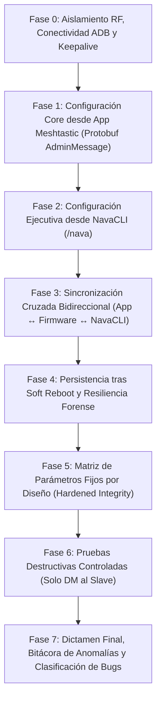

# 12 — PLAN MAESTRO DE AUDITORÍA Y BANCO DE PRUEBAS ULTRA-EXHAUSTIVO (NavaTastic V4)

> **ESTADO 17/08/2026 — PREPARACIÓN FASE V4**: Matriz extendida de **65 casos de prueba sistemáticos**
> para validar la consistencia bidireccional entre la App Oficial de Meshtastic (Protobuf / AdminMessages),
> el firmware NavaTastic V4 (4.3.3) y NavaCLI (`/nava`), la persistencia tras Soft Reboots y la sincronización UI.
> 📘 **Plan de Implementación**: [implementation_plan.md](../../implementation_plan.md)
> 📄 **Informe Consolidado Previo (V3)**: [docs/INFORME_DOBLE_AUDITORIA_NAVATASTIC_Y_MESHNAVARRA.md](../INFORME_DOBLE_AUDITORIA_NAVATASTIC_Y_MESHNAVARRA.md)

---

## 0. REGLAS DE ORO OPERATIVAS (INNEGOCIABLES)

1. **Seguridad Absoluta del Xiaomi Mi 10 (Teléfono del Padre del Operador)**:
   * **Cero perrerías**: Ningún comando afectará al sistema de archivos del teléfono (`/sdcard/DCIM`, fotos, descargas, etc. son 100% intocables).
   * **Aislamiento ADB**: Solo interactuar con los paquetes de las aplicaciones autorizadas (`com.geeksville.mesh` y `com.meshkachoutility`).
   * **Prohibido cualquier wipe/reset en Android**.
2. **Prohibido Tocar Código de Firmware sin Orden Explícita**:
   * La auditoría es de diagnóstico, prueba y recolección de evidencias.
   * Si se detecta un comportamiento anómalo o bug, **se reporta al operador**, se documenta en el registro y se espera confirmación antes de tocar una sola línea de código en `src/` o `variants/`.
3. **Antiespeculación y Pragmatismo Técnico**:
   * No asumir que NavaTastic falla ante el primer error de configuración remota.
   * Aplicar reintentos progresivos (hasta 3 intentos) ante colisiones RF en SF Narrow.
4. **Respeto Estricto de Tiempos y Cooldowns**:
   * Dejar pausas adecuadas entre comandos: $\ge 4$ s para consultas normales, $\ge 15$ s tras cambios de radio, $\ge 30$ s tras reboots/resets para permitir re-sintonización y re-conexión de malla.
5. **Dieta de Tokens y Handover Permanente**:
   * Mantener el cerebro y bitácora actualizados en caliente; registrar cada prueba con su ID exacto.

---

## 1. TOPOLOGÍA Y ROLES DE BANCO

| Rol | Hardware | Conexión | Firmware / Software | Control |
|---|---|---|---|---|
| **`Slave`** (Montaña / Bajo Prueba) | Faketec 1 (HT-RA62) | **USB → PC (COM9)** | NavaTastic 4.3.3 V4 (Rama 2 General) | Serial API directo / Logs COM9 |
| **`Master`** (Admin / Timonel) | Faketec 2 (HT-RA62) | **USB OTG → Mi 10** | Meshtastic Oficial / NavaTastic Banco | App Meshtastic + MeshNavarra Utility |
| **Control Remoto Móvil** | Xiaomi Mi 10 | **WiFi ADB (`192.168.3.141:5555`)** | Android 12 / MIUI | `adb shell am broadcast` (`RemoteControlReceiver`) |

- **Banda de aislamiento**: **869.545 MHz** / TX power **1 dBm** / Override Duty Cycle.
- **Canal 0**: SFNarrow (PSK default `AQ==`).
- **Canal 1**: Navadmin (PSK pública `{0x01}` = `AQ==`, slot 1 inamovible).

---

## 2. MATRIZ MAESTRA DE 65 CASOS DE PRUEBA (7 FASES)

### 🔹 Estructura de Fases:
- **Fase 0 (4 pruebas)**: Enlace ADB, Keepalive Android, Conmutación Inter-App y Handshake PKI.
- **Fase 1 (30 pruebas)**: Configuración remota exhaustiva desde la App Oficial Meshtastic (Bluetooth, Device, LoRa, Posición, Pantalla, Canales y Módulos).
- **Fase 2 (48 pruebas)**: Catálogo completo de comandos NavaCLI en abierto (Navadmin) y por DM PKI.
- **Fase 3 (14 pruebas)**: Sincronización bidireccional cruzada (App $\rightarrow$ NavaCLI y NavaCLI $\rightarrow$ App) con inspección de UI.
- **Fase 4 (4 pruebas)**: Persistencia tras Soft Reboots sistemáticos, cortes eléctricos en fuente, anti-tormentas en arranque y aviso `[Boot]`.
- **Fase 5 (4 pruebas)**: Validación de parámetros fijos por diseño (Navadmin inamovible, auto-inyección de rescate, persistencia de desautorización).
- **Fase 6 (3 pruebas)**: Pruebas destructivas controladas estrictamente por DM (`keys_clear`, `full_reset`, `wipe`).
- **Fase 7**: Consolidación del informe final con clasificación de hallazgos (PASS, BUG CONFIRMADO, ANOMALÍA A CONSULTAR, LIMITACIÓN HARDWARE).

