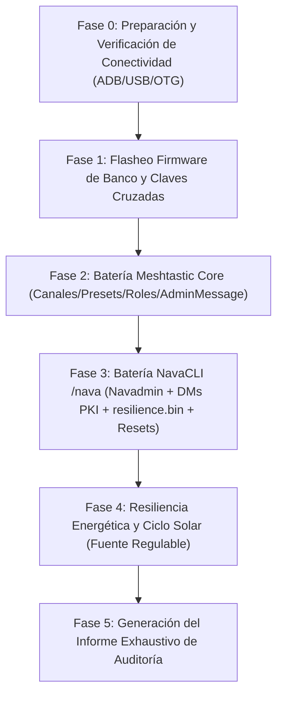

# 12 — PLAN MAESTRO DE AUDITORÍA Y BANCO DE PRUEBAS (NavaTastic V3)

> **ESTADO 16/08/2026 — VIGENTE**: Especificación canónica para la auditoría y testeo automatizado
> end-to-end de NavaTastic V3. Topología de banco con dos nodos reales (Faketec) enlazados por LoRa
> en frecuencia de aislamiento, controlados por PC (USB) y Xiaomi Mi 10 (OTG + ADB WiFi).

---

## 0. REGLAS DE ORO OPERATIVAS (INNEGOCIABLES)

1. **Seguridad Absoluta del Xiaomi Mi 10 (Teléfono del Padre del Operador)**:
   * **Cero perrerías**: Ningún comando afectará al sistema de archivos del teléfono (`/sdcard/DCIM`, fotos, descargas, etc. son 100% intocables).
   * **Aislamiento ADB**: Solo interactuar con los paquetes de las aplicaciones autorizadas (`com.geeksville.mesh` y `com.meshkachoutility`).
   * **Prohibido cualquier wipe/reset en Android**.
2. **Prohibido Tocar Código de Firmware sin Orden Explícita**:
   * La auditoría es de diagnóstico, prueba y recolección de evidencias.
   * Si se detecta un comportamiento anómalo o bug, **se reporta al operador**, se documenta en el FIX LOG y se espera confirmación antes de tocar una sola línea de código en `src/` o `variants/`.
3. **Antiespeculación y Pragmatismo Técnico**:
   * No asumir que NavaTastic falla ante el primer error de configuración remota.
   * Si la configuración remota por radio se atasca, reportar y conectar el nodo Master al PC para configurarlo directamente por USB (lección F-02).
4. **Respeto Estricto de Tiempos y Cooldowns**:
   * Dejar pausas adecuadas entre comandos: $\ge 2$ s para consultas normales, $\ge 15$ s tras cambios de radio, $\ge 30$ s tras reboots/resets para permitir re-sintonización y re-conexión de malla.
5. **Dieta de Tokens y Handover Permanente**:
   * Mantener el cerebro y bitácora actualizados en caliente; snapshot previo creado en `_archivo/` antes de iniciar pruebas.

---

## 1. TOPOLOGÍA Y ROLES DE BANCO

| Rol | Hardware | Conexión | Firmware / Software | Control |
|---|---|---|---|---|
| **`Slave`** (Montaña / Bajo Prueba) | Faketec 1 (HT-RA62) | **USB → PC (COMx)** | NavaTastic 4.3.2 V3 (Rama 2 Propia / General) | Meshtastic CLI Python / Serial API directo |
| **`Master`** (Admin / Timonel) | Faketec 2 (HT-RA62) | **USB OTG → Mi 10** | Meshtastic Oficial / NavaTastic Banco | App Meshtastic + MeshNavarra Utility |
| **Control Remoto Móvil** | Xiaomi Mi 10 | **WiFi ADB (`192.168.3.141:5555`)** | Android 12 / MIUI | `adb shell am broadcast` (`RemoteControlReceiver`) |

- **Banda de aislamiento**: **869.545 MHz** / hop 1 / TX power **1 dBm** / duty-cycle override ON.
- **Canal 0**: SFNarrow (PSK default `AQ==`).
- **Canal 1**: Navadmin (PSK pública `{0x01}` = `AQ==`, slot 1 inamovible).

---

## 2. HERRAMIENTAS Y CANALES DE CONTROL

### 2.1 Control del `Slave` (PC)
* `meshtastic --port COMx --info` (lectura completa de estado, canales y NodeDB).
* Inspección de `/resilience.bin` y LittleFS por USB.
* Volcado de logs serie en tiempo real.

### 2.2 Control del `Master` (Xiaomi Mi 10 vía ADB)
* **MeshNavarra Utility (`RemoteControlReceiver`)**:
  * Envío de comandos `/nava` sin tocar la pantalla:
    `adb -s 192.168.3.141:5555 shell am broadcast -n com.meshkachoutility/.RemoteControlReceiver -a com.meshkachoutility.REMOTE --es cmd send_nava --es arg "<cmd>" --es arg2 "!<ID_SLAVE>"`
  * Volcado de estado de la app: `cmd state` $\rightarrow$ `remote_state.json`.
  * Volcado de nodos: `cmd nodes` $\rightarrow$ `nodes_dump.json`.
  * Activación de pestaña Debug: `cmd debug_tab --es arg "on"`.
* **App Oficial Meshtastic**:
  * Pruebas de configuración remota por AdminMessage Protobuf PKI (cambio de presets, canales secundarios, roles, traceroutes).

---

## 3. MATRIZ EXTENDIDA DE PRUEBAS (5 FASES)

### 🔹 Fase 0: Preparación y Verificación de Conectividad
- [x] **Conexión ADB WiFi Mi 10 (`192.168.3.141:5555`)**: VERIFICADA Y ACTIVA ✅.

### 🔹 Fase 1: Firmware de Laboratorio y Emparejamiento Limpio
- [x] **PASO A (Master en USB - Faketec 2)**: COMPLETADO CON ÉXITO ✅.
  * Node ID: `!8289015a` (`2190016858`) | MAC: `dd:cf:82:89:01:5a`.
  * Clave Pública PKI: `0zhwc1+6SDuin5WhQjS68Rr+VL6vo1y47UXvsOWN7iQ=`.
  * Configuración fijada: Frecuencia `869.545 MHz` · TX `1 dBm` · `override_duty_cycle = true` · Canal 1 `Navadmin` (`AQ==`).
- [x] **PASO B (Slave en USB - Faketec 1)**: COMPLETADO CON ÉXITO ✅.
  * Firmware Flasheado: NavaTastic 4.3.2 V3 (`navarrico_faketec_sx1262_r2ig`) con DFU upload exitoso (178.33 s) ✅.
  * Node ID: `!3a89ac94` (`982099092`).
  * Clave Pública PKI: `1Yl1a44tSbqVg8LQYgjGRpN/SH62tqfmc58A+508+2Y=`.
  * Clave Admin inyectada en Slot 0: `0zhwc1+6SDuin5WhQjS68Rr+VL6vo1y47UXvsOWN7iQ=` (Clave del Master) ✅.
  * Configuración fijada: Frecuencia `869.545 MHz` · TX `1 dBm` · `override_duty_cycle = true` · Canal 1 `Navadmin` (`AQ==`).
- [x] **PASO C (Montaje definitivo y Test de Enlace Radio)**: COMPLETADO CON ÉXITO ✅.
  * Traceroute bidireccional por radio OK:
    `!3a89ac94 --> 8289015a` (12.75 dB) | `8289015a --> !3a89ac94` (11.5 dB).
  * NodeDB sincronizada a 0 saltos.

### 🔹 Fase 2: Batería Meshtastic Core (App Oficial + AdminMessage)
- [ ] **Prueba 2.1 — Renombrado Remoto (`set_owner`)**: PENDIENTE.
- [ ] **Prueba 2.2 — Cambio de Preset (`SFNarrow` -> `MEDIUM_FAST`) y persistencia**: PENDIENTE.
- [ ] **Prueba 2.3 — Canales Secundarios (Creación Canal 2 y 3 sin alterar Navadmin en Slot 1)**: PENDIENTE.
- [ ] **Prueba 2.4 — Cambio Remoto de Roles (`ROUTER` / `CLIENT`)**: PENDIENTE.
- [ ] **Prueba 2.5 — Traceroutes y Telemetría Remota**: PENDIENTE.

### 🔹 Fase 3: Batería NavaCLI (`/nava`) y Persistencia Forense
1. **Canal 1 (Navadmin abierto)**:
   * Comandos de solo lectura: `ping`, `status`, `env`, `channel`, `peers`, `rxlog`, `afc`, `noise`, `bat`, `help`.
   * Rechazo de comandos de escritura: Verificar respuesta `SOLO DM SEGURO`.
2. **DM Cifrado PKI (Control Admin)**:
   * Parámetros de radio y energía: `set_chem`, `set_vbat`, `set_vwake`, `set_txpower`, `set_hops`, `set_role`, `fav auto`, `sleepmsg`.
   * Gestión de nodos: `fav add/rm/ls`, `ign add/rm/ls`.
3. **Escalera de Resets y `/resilience.bin`**:
   * `/nava keys_ls` $\rightarrow$ listar claves.
   * `/nava full_reset` $\rightarrow$ verificar que mantiene claves admin de usuario y par PKI.
   * `/nava factory_reset` $\rightarrow$ verificar que mantiene claves admin pero renueva PKI.
   * `/nava wipe` $\rightarrow$ purga total de `/resilience.bin`.
   * Prueba de tamaño LittleFS: verificar que `/resilience.bin` mantiene exactamente 84 bytes.
4. **Seguridad y Whitelist**: Intento de comando admin desde nodo no autorizado $\rightarrow$ verificar `NO AUTORIZADO`.
5. *Reporte al operador y solicitud de permiso.*

### 🔹 Fase 4: Resiliencia y Ciclo Solar en Fuente de Laboratorio
1. `Slave` conectado a la fuente regulable del operador.
2. **Descenso de voltaje**: Bajar por debajo de OCV $\rightarrow$ verificar aviso `[Sueño]` por canal 1 $\rightarrow$ consumo ~1 mA.
3. **Ascenso solar**: Subir voltaje $\rightarrow$ registrar disparo de **LPCOMP** $\rightarrow$ verificar aviso `[Listo]` con mV $\rightarrow$ verificar aviso `[Boot]`.
4. *Reporte al operador y solicitud de permiso.*

### 🔹 Fase 5: Informe Final de Auditoría
1. Redacción de `docs/INFORME_AUDITORIA_NAVATASTIC_FINAL.md` con matriz de resultados, capturas, evidencias y tiempos.
2. Actualización de bitácora y cerebro.
3. Restauración de nodos a configuración estándar.
