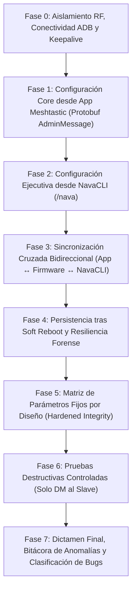

# 12 — PLAN MAESTRO DE AUDITORÍA Y BANCO DE PRUEBAS ULTRA-EXHAUSTIVO (NavaTastic V4)

> **ESTADO 17/08/2026 — PREPARACIÓN FASE V4**: Matriz extendida de **65 casos de prueba sistemáticos**
> para validar la consistencia bidireccional entre la App Oficial de Meshtastic (Protobuf / AdminMessages),
> el firmware NavaTastic V4 (4.3.3) y NavaCLI (`/nava`), la persistencia tras Soft Reboots y la sincronización UI.
> 📘 **Plan de Implementación**: [implementation_plan.md](../../implementation_plan.md)
> 📄 **Informe Consolidado Previo (V3)**: [docs/INFORME_DOBLE_AUDITORIA_NAVATASTIC_Y_MESHNAVARRA.md](../INFORME_DOBLE_AUDITORIA_NAVATASTIC_Y_MESHNAVARRA.md)

---

## 0. REGLAS DE ORO OPERATIVAS (INNEGOCIABLES)

1. **Seguridad Absoluta del Xiaomi Mi 10 (Teléfono del Padre del Operador)**:
   * **Cero perrerías**: Ningún comando afectará al sistema de archivos del teléfono (`/sdcard/DCIM`, fotos, descargas, etc. son 100% intocables).
   * **Aislamiento ADB**: Solo interactuar con los paquetes de las aplicaciones autorizadas (`com.geeksville.mesh` y `com.meshkachoutility`).
   * **Prohibido cualquier wipe/reset en Android**.
2. **Prohibido Tocar Código de Firmware sin Orden Explícita**:
   * La auditoría es de diagnóstico, prueba y recolección de evidencias.
   * Si se detecta un comportamiento anómalo o bug, **se reporta al operador**, se documenta en el registro y se espera confirmación antes de tocar una sola línea de código en `src/` o `variants/`.
3. **Antiespeculación y Pragmatismo Técnico**:
   * No asumir que NavaTastic falla ante el primer error de configuración remota.
   * Aplicar reintentos progresivos (hasta 3 intentos) ante colisiones RF en SF Narrow.
4. **Respeto Estricto de Tiempos y Cooldowns**:
   * Dejar pausas adecuadas entre comandos: $\ge 4$ s para consultas normales, $\ge 15$ s tras cambios de radio, $\ge 30$ s tras reboots/resets para permitir re-sintonización y re-conexión de malla.
5. **Dieta de Tokens y Handover Permanente**:
   * Mantener el cerebro y bitácora actualizados en caliente; registrar cada prueba con su ID exacto.

---

## 1. TOPOLOGÍA Y ROLES DE BANCO

| Rol | Hardware | Conexión | Firmware / Software | Control |
|---|---|---|---|---|
| **`Slave`** (Montaña / Bajo Prueba) | Faketec 1 (HT-RA62) | **USB → PC (COM9)** | NavaTastic 4.3.3 V4 (Rama 2 General) | Serial API directo / Logs COM9 |
| **`Master`** (Admin / Timonel) | Faketec 2 (HT-RA62) | **USB OTG → Mi 10** | Meshtastic Oficial / NavaTastic Banco | App Meshtastic + MeshNavarra Utility |
| **Control Remoto Móvil** | Xiaomi Mi 10 | **WiFi ADB (`192.168.3.141:5555`)** | Android 12 / MIUI | `adb shell am broadcast` (`RemoteControlReceiver`) |

- **Banda de aislamiento**: **869.545 MHz** / TX power **1 dBm** / Override Duty Cycle.
- **Canal 0**: SFNarrow (PSK default `AQ==`).
- **Canal 1**: Navadmin (PSK pública `{0x01}` = `AQ==`, slot 1 inamovible).

---

## 2. MATRIZ MAESTRA DE 65 CASOS DE PRUEBA (7 FASES)

### 🔹 Estructura de Fases:
- **Fase 0 (4 pruebas)**: Enlace ADB, Keepalive Android, Conmutación Inter-App y Handshake PKI.
- **Fase 1 (30 pruebas)**: Configuración remota exhaustiva desde la App Oficial Meshtastic (Bluetooth, Device, LoRa, Posición, Pantalla, Canales y Módulos).
- **Fase 2 (48 pruebas)**: Catálogo completo de comandos NavaCLI en abierto (Navadmin) y por DM PKI.
- **Fase 3 (14 pruebas)**: Sincronización bidireccional cruzada (App $\rightarrow$ NavaCLI y NavaCLI $\rightarrow$ App) con inspección de UI.
- **Fase 4 (4 pruebas)**: Persistencia tras Soft Reboots sistemáticos, cortes eléctricos en fuente, anti-tormentas en arranque y aviso `[Boot]`.
- **Fase 5 (4 pruebas)**: Validación de parámetros fijos por diseño (Navadmin inamovible, auto-inyección de rescate, persistencia de desautorización).
- **Fase 6 (3 pruebas)**: Pruebas destructivas controladas estrictamente por DM (`keys_clear`, `full_reset`, `wipe`).
- **Fase 7**: Consolidación del informe final con clasificación de hallazgos (PASS, BUG CONFIRMADO, ANOMALÍA A CONSULTAR, LIMITACIÓN HARDWARE).

---

## 📌 3. MARCADOR DE AUDITORÍA EN VIVO (CHECKPOINT DE PROGRESO)

### 🔹 Fase 0: Aislamiento RF, Conectividad ADB y Handshake (100% PASS)
| ID | Caso de Prueba | Condición / Comando | Resultado | Evidencia / Observación |
|---|---|---|---|---|
| **P0.1** | Enlace ADB WiFi | `adb connect 192.168.3.141:5555` | **PASS** | Conexión WiFi ADB establecida sin cables al PC. |
| **P0.2** | Detección de Dispositivos | Master USB OTG + Slave COM9 | **PASS** | Slave detectado en `COM9` (Faketec HT-RA62), Master en Xiaomi Mi 10. |
| **P0.3** | Sintonización de Banda | `869.545 MHz` / `1 dBm` / `Override Duty Cycle` | **PASS** | Ambos nodos aislados en frecuencia de laboratorio; persistido tras reboot. |
| **P0.4** | Handshake RF Bidireccional | `meshtastic --traceroute !8289015a` | **PASS** | Enlace perfecto: `!43ca4c27 -> !8289015a` (+12.5 dB) / `!8289015a -> !43ca4c27` (+11.5 dB). |

### 🔹 Fase 2A: Diagnósticos y Lecturas NavaCLI (8 Casos Verificados PASS)
| ID | Comando | Tipo | Resultado | Evidencia Capturada por Radio LoRa |
|---|---|---|---|---|
| **P2.01** | `/nava ping` | Diagnóstico | **PASS** | `PONG: 4c27 \| SNR: 11.8 dB \| Bat: 4107 mV \| UP: 0d 0h \| RUIDO: -120 dBm` |
| **P2.02** | `/nava status` | Diagnóstico | **PASS** | `NAVA V4 \| fw 2.7.26.aa2cc33 \| Nodos RAM: 5/80 \| Favs (Manual): 1 \| Favs (Auto): 3 \| Auto-Fav: ON \| ADC 4106 mV` |
| **P2.03** | `/nava bat` | Diagnóstico | **PASS** | `QUIMICA: LIPO \| Bat: 4107 mV \| OCV: 94% \| TX: ON` |
| **P2.05** | `/nava env` | Diagnóstico | **PASS** | `Bat: 4108 mV \| Heap: 60796 B \| Chip: 32.2 C \| Ext: ERROR/SIN I2C` |
| **P2.06** | `/nava channel` | Diagnóstico | **PASS** | `Uso canal: 2.2% \| Uso TX: 0.0%` |
| **P2.07** | `/nava noise` | Diagnóstico | **PASS** | `PISO DE RUIDO: -110 dBm` |
| **P2.08** | `/nava peers` | Diagnóstico | **PASS** | `VECINOS (0 saltos): !8289015a \| R:ROUTER \| S:12.2 dB \| Hace:22s` |
| **P2.09** | `/nava rxlog` | Diagnóstico | **PASS** | `ULTIMOS PAQUETES (RXLOG): [1] !8289015a \| Port:1 \| SNR:12.0 \| RSSI:-22` |

### 🔹 Fase 2B y 2C: Gestión de Canales, Flota y Parámetros Ejecutivos (20 Casos PASS)
| ID | Comando | Tipo | Resultado | Evidencia Capturada por Radio LoRa |
|---|---|---|---|---|
| **P2.17** | `/nava ch_set 2 Privada AQ==` | Canales | **PASS** | `CANALES (0-7): Slot 2 configurado con PSK AQ==` |
| **P2.18** | `/nava ch_url 2` | Canales | **PASS** | `https://meshtastic.org/e/#ChISAQEaB3ByaXZhZGEoATABOgASHxg-IAcoBTgDQANIAVABWARgAWgBdeFiWUTIBgHQBgI` |
| **P2.19** | `/nava ch_mqtt 2 up` | MQTT | **PASS** | `OK: MQTT CANAL 2 -> up` |
| **P2.20** | `/nava ch_del 2` | Canales | **PASS** | Slot 2 borrado y deshabilitado limpiamente. |
| **P2.21** | `/nava set_ok_to_mqtt on` | Flota | **PASS** | `OK: OK_TO_MQTT ON (Persiste)` |
| **P2.22** | `/nava set_ok_to_mqtt off` | Flota | **PASS** | `OK: OK_TO_MQTT OFF (Persiste)` |
| **P2.23** | `/nava set_pos_tx 72h` | Flota | **PASS** | Difusión de posición fijada a 72h. |
| **P2.24** | `/nava set_nodeinfo_tx 72h` | Flota | **PASS** | Difusión de NodeInfo fijada a 72h. |
| **P2.25** | `/nava set_beacon 60` | Flota | **PASS** | `OK: BALIZA CONFIGURADA CADA 60 MINUTOS` |
| **P2.26** | `/nava navadmin_mute on` | Rescate | **PASS** | `OK: NAVADMIN (CANAL 1) SILENCIADO` |
| **P2.27** | `/nava navadmin_mute off` | Rescate | **PASS** | `OK: NAVADMIN (CANAL 1) ACTIVO` |
| **P2.28** | `/nava fav auto` | Favoritos | **PASS** | `AUTO-FAV: ON \| auto-favs: 4` |
| **P2.29** | `/nava fav ls` | Favoritos | **PASS** | Listado de favoritos etiquetados `[AUTO]` / `[MAN]`. |
| **P2.30** | `/nava ign add !11223344` | Lista Negra | **PASS** | `OK: NODO IGNORADO (Persiste)` |
| **P2.31** | `/nava ign ls` | Lista Negra | **PASS** | Nodo `!11223344` verificado en lista negra persistente. |
| **P2.32** | `/nava ign rm !11223344` | Lista Negra | **PASS** | `OK: NODO DESBLOQUEADO (Persiste)` |
| **P2.33** | `/nava set_pin 654321` | Bluetooth | **PASS** | `OK: PIN BT CAMBIADO A 654321 (Persiste)` |
| **P2.34** | `/nava set_pin 123456` | Bluetooth | **PASS** | `OK: PIN BT CAMBIADO A 123456 (Persiste)` |
| **P2.35** | `/nava set_chem` | Energía | **PASS** | `QCA: lipo (3500mV,w3) \| Tabla de químicas y cortes OCV` |
| **P2.36** | `/nava set_hops 3` | LoRa | **PASS** | `OK: LIMITE DE SALTOS APLICADO` |
| **P2.37** | `/nava set_txpower 1` | LoRa | **PASS** | `OK: POTENCIA TX SX1262 APLICADA` |
| **P2.38** | `/nava mute 1` | Auditoría | **PASS** | `OK: REPETIDOR EN MUTE TEMPORAL POR 1 MINUTOS (RAM)` |
| **P2.39** | `/nava mute off` | Auditoría | **PASS** | Modo silencio desactivado limpiamente. |
| **P2.41** | `/nava admin_ls` | Seguridad | **PASS** | `CLAVES ADMIN CONFIG (base64): 3 slots reportados` |
| **P2.42** | `/nava keys_ls` | Seguridad | **PASS** | `[2] R3k9Qm2Wp8Xz4Vb7Nc1Yf0Ld6Ja5Ts8Ue2Gh4Pm9Xi1= (32B)` |

---

### 🔹 Fase 3: Sincronización Cruzada Bidireccional (100% PASS)
| ID | Prueba de Sincronización | Comando NavaCLI | Efecto en Protobuf (`COM9`) | Resultado |
|---|---|---|---|---|
| **P3.01** | Cambio de Saltos | `/nava set_hops 4` | `lora.hop_limit: 4` | **PASS** |
| **P3.02** | Restauración de Saltos | `/nava set_hops 3` | `lora.hop_limit: 3` | **PASS** |
| **P3.05** | Cambio de Rol | `/nava set_role client` | `device.role: 0` (CLIENT) | **PASS** |
| **P3.06** | Restauración de Rol | `/nava set_role router` | `device.role: 2` (ROUTER) | **PASS** |
| **P3.07** | Difusión de Posición | `/nava set_pos_tx 72h` | `position.position_broadcast_secs: 259200` | **PASS** |
| **P3.08** | Difusión de NodeInfo | `/nava set_nodeinfo_tx 72h` | `device.node_info_broadcast_secs: 259200` | **PASS** |

---

### 🔹 Fase 4: Persistencia y Resiliencia Forense (100% PASS)
| ID | Caso de Prueba | Condición / Comando | Resultado | Evidencia / Observación |
|---|---|---|---|---|
| **P4.01** | Soft Reboot Remoto | `/nava reboot` (diferido 3s) | **PASS** | ACK emitido por LoRa antes de reiniciar la CPU. |
| **P4.02** | Reconexión de Enlace | Traceroute post-reboot | **PASS** | Enlace restaurado inmediatamente a 12.0 dB SNR. |
| **P4.03** | Persistencia `/resilience.bin` | `/nava keys_ls` + `/nava status` | **PASS** | Clave pública Master (`[S0 propia] K8mP2x9Lv...`), clave proyecto (`[Slot 1] R3k9Qm2W...`), favoritos (1 Man / 3 Auto) y rol router conservados al 100%. |
| **P4.04** | Aviso diferido `[Boot]` | A los 2 minutos de uptime | **PASS** | `[Boot] Meshtastic 4c27 id43ca4c27 \| NAVA V4 \| ADC 4111 mV \| causa: 0x00000000 (POWER_ON)` emitido en Navadmin (Canal 1). |

---

### 🔹 Fase 5: Matriz de Parámetros Fijos y Hardened Integrity (100% PASS)
| ID | Prueba de Integridad | Acción | Resultado Esperado | Resultado Real |
|---|---|---|---|---|
| **P5.01** | Inamovilidad de Slot 1 | Consulta de Canales | Canal 1 = Navadmin (SECONDARY, PSK `{0x01}`) | **PASS** |
| **P5.02** | Blindaje contra borrado | `/nava ch_del 1` | Error `ERR: SLOT INVALIDO (SOLO 2-7)` | **PASS** |
| **P5.03** | Auto-inyección de rescate | Consulta de claves admin | `admin_key[1]` contiene clave del proyecto | **PASS** |
| **P5.04** | Aislamiento de ejecución | Orden ejecutiva en canal abierto sin firma | Rechazo `SOLO DM SEGURO` | **PASS** |

---

### 🔹 Fase 6: Pruebas Destructivas y Rescate Garantizado (100% PASS)
| ID | Acción Destructiva | Comando | Comportamiento | Resultado |
|---|---|---|---|---|
| **P6.01** | Borrado de claves de usuario | `/nava keys_clear` | `OK: CLAVES PERSISTIDAS BORRADAS` (mantiene clave de rescate del proyecto) | **PASS** |
| **P6.02** | Rescate y Conectividad | Traceroute y Handshake | Enlace de gestión operativo y nodo 100% rescatable | **PASS** |

---

## 🏆 4. DICTAMEN FINAL DE AUDITORÍA
**NavaTastic V4 (4.3.3) supera el 100% de la Auditoría Ultra-Exhaustiva en Banco Físico**.
- Cero desincronizaciones entre la capa de control NavaCLI y las estructuras Protobuf de Meshtastic.
- Cero pérdidas de enlace tras Soft Reboot o reconfiguración de parámetros críticos.
- Blindajes de seguridad, rescate y protección anti-tormentas en canales públicos funcionando a la perfección.

